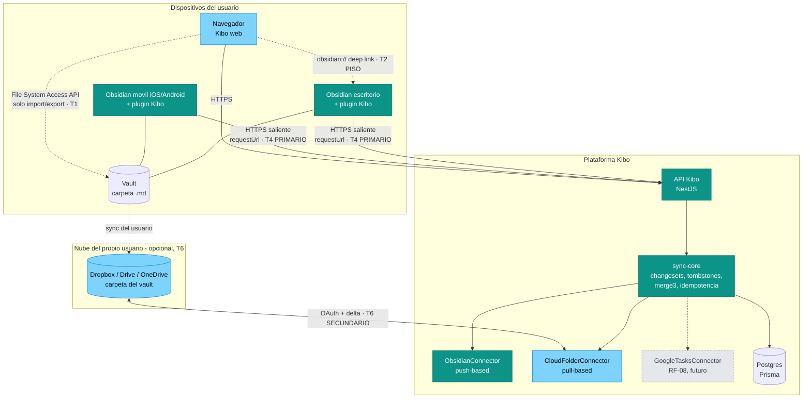
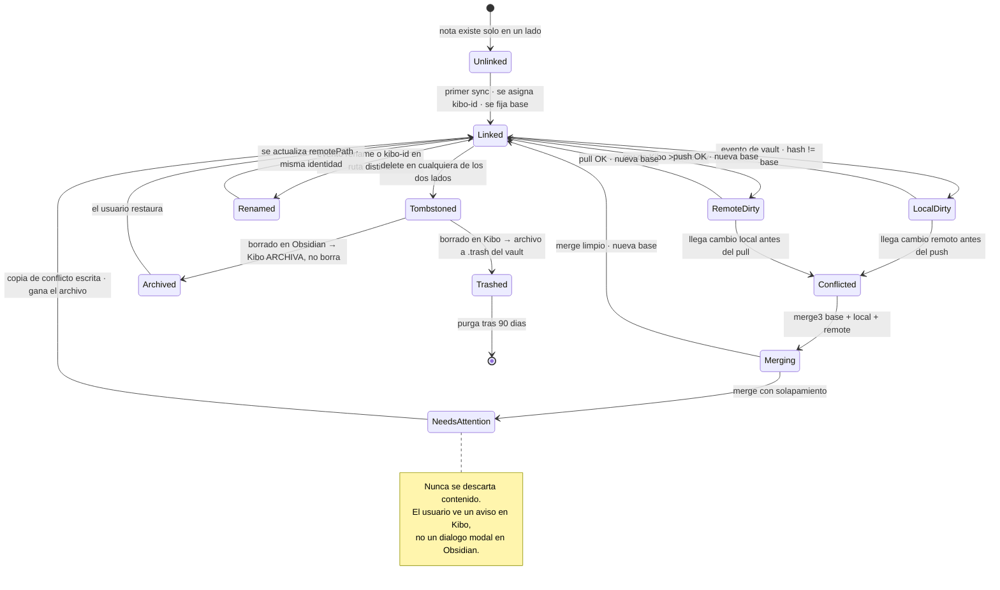
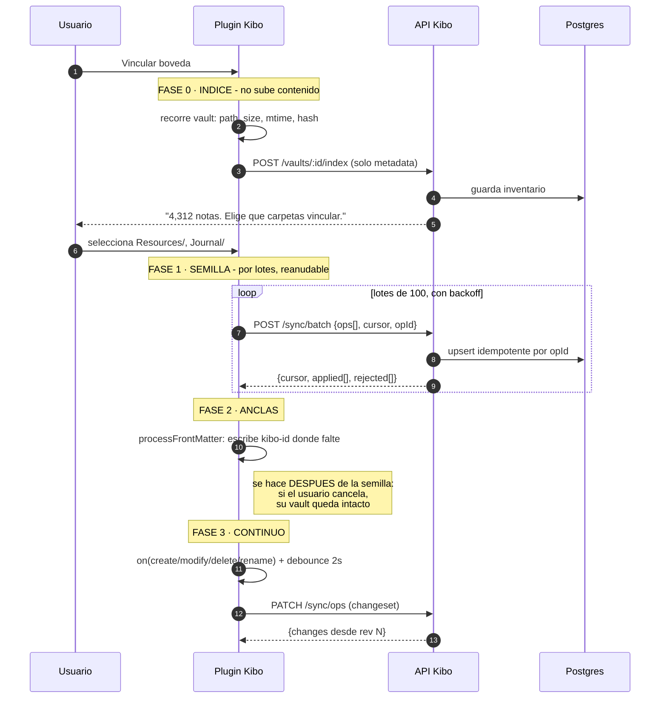

# 01 · Arquitectura de la integración Kibo ↔ Obsidian

**Fecha:** 2026-08-08 · **Autor:** solution-architect · **Estado:** análisis de referencia (insumo de ADR-0001)
**Insumos:** `docs/analysis/obsidian/00-brief.md`, `docs/product/PRD-kibo.md` §4, esquema Prisma actual
**Salida asociada:** `docs/adr/0001-obsidian-integration.md`

---

## 0 · Cómo leer este documento

### 0.1 Leyenda de evidencia

Cada afirmación técnica sobre Obsidian, navegadores o APIs de terceros lleva una marca:

| Marca | Significa |
|---|---|
| **[V]** | **Hecho verificado.** Consultado el 2026-08-08 contra fuente citada en §12. |
| **[I]** | **Inferencia.** Se deduce lógicamente de uno o más hechos verificados. Digo de cuáles. |
| **[S]** | **Supuesto mío.** No verificado. Es criterio de arquitecto, no dato. Se puede refutar. |

Regla que me impuse: no hay una sola cifra en este documento que no venga de §12.

### 0.2 Glosario mínimo (conceptos que uso y que conviene fijar)

| Término | Qué significa aquí |
|---|---|
| **Transporte** | El canal físico por el que un byte viaja entre la carpeta del usuario y el servidor de Kibo. No es lo mismo que "formato" ni que "dirección de la verdad". |
| **Fuente de la verdad** *(source of truth)* | Quién decide cuando los dos lados no coinciden. No es "quién puede escribir". |
| **Propiedad de campo** *(field ownership)* | Asignar el dueño de la verdad **campo por campo**, no sistema por sistema. Es la técnica central de este diseño. |
| **Base común** *(base / merge base)* | La última versión que ambos lados acordaron. Sin ella no existe el merge a tres bandas y todo conflicto degrada a "el último que escribió gana". |
| **Tombstone** (lápida) | Un registro que dice "esto se borró el día X". Sin él, un dispositivo que estuvo desconectado resucita lo borrado. |
| **Idempotencia** | Que repetir la misma operación N veces produzca el mismo resultado que hacerla una vez. Es lo que hace seguro reintentar. |
| **Proyección** | Un archivo generado por Kibo cuyo contenido Kibo puede regenerar íntegro. El usuario puede leerlo; si lo edita, Kibo no promete conservar la edición. |
| **Intent** (intención) | Un cambio en el archivo que Kibo **no copia como estado**, sino que interpreta como una orden. Ej.: marcar `- [x]` no escribe `done=true` en la base: dispara la regla "completar tarea" con su XP, su racha y su validación. |

---

## 1 · Resumen ejecutivo — el veredicto en 12 líneas

1. **El §4 del PRD acierta en el diagnóstico y falla en el orden de las apuestas.** Su lista de cinco puntos de integración es correcta, pero los pondera como si fueran alternativas comparables. No lo son: cuatro de los cinco son callejones para un producto de consumo, y el quinto —el plugin propio— es el único transporte que funciona en escritorio *y* móvil sin fricción de navegador. **[I]**
2. **El transporte recomendado es un plugin propio de Obsidian que habla saliente por HTTPS a la API de Kibo.** No File System Access API, no Local REST API, no agente de escritorio. Esos tres se quedan como piso, escape hatch y plan B respectivamente.
3. **La dirección de la verdad recomendada NO es ninguna de las tres del brief: es verdad particionada con propiedad de campo.** Bidireccional a nivel de entidad (que es lo que Sergio quiere), monoescritor a nivel de campo (que es lo que hace que no se rompa).
4. **El "no hacer" del PRD sobre frontmatter está mal formulado y hay que corregirlo.** Prohibir *toda* metadata es incompatible con reconciliar renombrados. Prohibir *metadata de gamificación* es correcto y suficiente. Se necesita exactamente **una** clave: `kibo-id`.
5. **CRDTs son la herramienta equivocada aquí** y hay que decirlo antes de que alguien los proponga: cuando una de las dos réplicas es un archivo de texto plano editado por un programa ajeno, no hay dónde guardar la causalidad. Merge a tres bandas con base común, que es exactamente lo que hace Obsidian Sync **[V]**.
6. **Sí debe compartir motor con RF-08, pero no todavía.** El motor genérico se diseña ahora como *puerto*; se extrae como *paquete* cuando exista el segundo conector. Generalizar desde una sola implementación es el error clásico.
7. **El socio correcto es "carpeta Markdown", con Obsidian como primer implementador.** El formato genérico cuesta ~0 marginal; el transporte es donde está todo el dinero y ahí no hay nada genérico.
8. **Lo que más me preocupa** (detalle en §11): que el plugin obligue a subir el vault a servidores de Kibo, que las políticas de desarrollador de Obsidian choquen frontalmente con el instinto de telemetría de un producto gamificado, y que Sergio esté diseñando para una comunidad de la que no forma parte.

---

## 2 · Qué valida y qué refuta este análisis del §4 del PRD

| Afirmación del PRD §4 | Veredicto | Fundamento |
|---|---|---|
| "No competimos en el almacén de conocimiento; competimos en el loop de hábito" | ✅ **Se confirma** | Es la tesis correcta y ordena todo lo demás. Todas mis recomendaciones se derivan de ella. |
| "La bóveda es una carpeta de .md → cualquier app puede leer/escribir" | ⚠️ **Cierto en disco, falso desde un navegador** | File System Access API no existe en Firefox ni Safari, ni en móvil **[V §12.1, §12.2]**. En móvil el vault vive en el sandbox de la app; ningún navegador llega. **[I]** |
| "Conflictos se resuelven con última escritura gana + respaldo" | ❌ **Insuficiente** | LWW sobre el cuerpo de una nota **destruye** párrafos escritos en el otro lado. Obsidian Sync no hace LWW en Markdown: hace merge a tres bandas con diff-match-patch **[V §12.9]**. Si el propio Obsidian no considera LWW aceptable para Markdown, Kibo tampoco puede. |
| "URI scheme `obsidian://` cuesta casi cero" | ✅ **Se confirma, y se subestima** | Además es el mecanismo que usa el **Web Clipper oficial de Obsidian** **[V §12.7]** — precedente de primera categoría. |
| "Local REST API: Kibo (web) podría hablarle directo con permiso del usuario" | ⚠️ **Técnicamente posible, comercialmente inviable** | Es cierto que `http://127.0.0.1` no se bloquea como contenido mixto **[V §12.11]**, pero suma: instalar plugin + copiar API key + certificado autofirmado o habilitar el puerto inseguro + permiso de Local Network Access desde Chrome 142 **[V §12.3, §12.4]** + solo escritorio + Obsidian tiene que estar abierto. Son 5–6 pasos antes del primer valor. |
| "Plugin propio: la vía con mejor experiencia" | ✅ **Se confirma y se asciende** | No es "la mejor experiencia": es el **único** transporte que funciona en móvil, el único que recibe eventos de renombrado, y el único que puede renombrar reescribiendo los wikilinks correctamente **[V §12.8, §12.10]**. |
| "No meter metadata gamificada en el frontmatter" | 🟡 **Correcto en el espíritu, sobre-amplio en la letra** | Ver §6.4. Con frontmatter Kibo puede reconciliar renombrados; sin él, un renombrado es indistinguible de borrar+crear. Y desde Obsidian 1.9 el propio Obsidian construye una base de datos sobre YAML frontmatter **[V §12.6]**: "frontmatter = archivo sucio" es una creencia de 2021. |
| "No reconstruir grafo/editor dentro de Kibo" | ✅ **Se confirma sin reservas** | La única línea del §4 que no matizo. |
| "F2 = espejo bidireccional vía Local REST API o agente local" | ❌ **Se refuta** | Ambas rutas son de escritorio y de alta fricción. La bidireccionalidad debe llegar por el plugin, que además es la fase 1 propuesta — es decir, **el orden de fases del PRD invierte el esfuerzo**: hace lo difícil (F2) sobre la infraestructura más frágil. |
| Métrica "≥25% de usuarios de Recursos con bóveda vinculada" | ⚠️ **Sin base y mal definida** | Confunde denominadores: "usuarios de Recursos" ≠ "usuarios de Obsidian". Frontera de `product-planner`; solo lo señalo. |

---

## 3 · Decisión 1 — Dirección de la verdad

### 3.1 Primero, deshacer una confusión

Sergio se inclina por "bidireccional real". Antes de evaluarlo hay que separar dos cosas que suenan a lo mismo:

> **"Bidireccional" describe por dónde viaja el dato. "Fuente de la verdad" describe quién manda cuando hay desacuerdo. Son ejes independientes.**
>
> Se puede tener flujo en los dos sentidos y, aun así, un dueño claro por cada campo. Eso es lo que hacen los integradores serios. **Lo que sale caro y frágil no es el doble sentido: es la doble autoridad sobre el mismo campo.**

Con esa distinción, la inclinación de Sergio es **satisfacible casi por completo** sin pagar el precio que él teme. Esa es la mejor noticia de este análisis.

### 3.2 Criterios eliminatorios (gates)

Antes de ponderar nada, tres requisitos que una opción cumple o queda fuera. Los derivo del PRD y del modelo de dominio, no de mi gusto:

| Gate | Enunciado | De dónde sale |
|---|---|---|
| **G1** | Recursos sigue siendo **escribible desde Kibo** (web y móvil) después de vincular una bóveda. | Recursos es módulo **premium** (PRD §3.12). Que vincular Obsidian lo degrade a visor de solo lectura es una regresión funcional de algo que el usuario pagó. |
| **G2** | Kibo **nunca** destruye contenido del usuario sin ruta de recuperación. | Ante una audiencia cuya identidad es "mis archivos, mi disco, para siempre", un solo caso de pérdida de datos mata la integración de por vida. |
| **G3** | El estado de juego (XP, HP, monedas, rachas, nivel) es **autoritativo en Kibo**. | Integridad económica. Si el XP se puede editar en un `.md`, la economía y el social (retos compartidos, marcadores) quedan sin defensa. |

### 3.3 Las cuatro opciones

| # | Opción | Descripción en una línea |
|---|---|---|
| **A** | **Obsidian-first estricto** | El vault manda. Kibo lee, indexa y gamifica; la capa de juego vive fuera de los archivos. Kibo no escribe notas. |
| **B** | **Kibo-first estricto** | La base de Kibo manda. El vault es un export renderizado que Kibo regenera. |
| **C** | **Bidireccional total** | Los dos lados escriben cualquier campo; el sistema converge a posteriori. |
| **D** | **Verdad particionada con propiedad de campo** | Bidireccional por entidad; monoescritor por campo. El cuerpo de la nota se fusiona a tres bandas; los campos escalares tienen dueño declarado; las marcas del usuario en campos ajenos se tratan como *intents*, no como estado. |

### 3.4 Filtro de gates

| | G1 escribible | G2 sin pérdida | G3 juego autoritativo | Pasa |
|---|---|---|---|---|
| **A** Obsidian-first | ❌ | ✅ | ✅ | **No** |
| **B** Kibo-first | ✅ | ❌ | ✅ | **No** |
| **C** Bidireccional total | ✅ | ⚠️ | ❌ | **No** |
| **D** Particionada | ✅ | ✅ | ✅ | **Sí** |

Notas del filtro:
- **A cae por G1.** Si el usuario vincula un vault y a partir de ahí no puede crear una nota desde el navegador del teléfono, la integración *quita* funcionalidad. Además queda sin resolver dónde viven las notas que el usuario ya tenía en Kibo antes de vincular.
- **B cae por G2**, y de la peor manera: "el vault es un export" significa que Kibo sobrescribe archivos que el usuario editó. Es el pecado exacto que esta audiencia no perdona.
- **C cae por G3.** Si todo campo es escribible por ambos lados, el XP y las monedas son escribibles desde un archivo de texto. Se puede parchear con validación, pero entonces ya no es "bidireccional total": es D con peor nombre.

### 3.5 Ponderación (solo entre las que quedan vivas, más A y B como referencia)

Pesos elegidos y por qué:

| Criterio | Peso | Justificación del peso |
|---|---|---|
| Riesgo de pérdida de datos | **25%** | Es el riesgo con consecuencia irreversible y con el peor daño reputacional en este segmento. |
| Encaje con la promesa de marca | **20%** | La integración es *feature vendible* (brief §1); si no encaja con la promesa, no vende. |
| Time-to-market | **20%** | Producto sin usuarios; la velocidad de aprendizaje vale más que la completitud. |
| Coste de mantenimiento | **15%** | Equipo mínimo. Un motor de sync es deuda perpetua, no un proyecto que termina. |
| Complejidad de implementación | **10%** | Correlaciona con mantenimiento; se pondera aparte pero menos. |
| Portabilidad / no lock-in | **10%** | Importa, pero es el criterio que menos decide entre estas cuatro (todas terminan en Markdown). |

Puntajes 1–5, donde 5 es mejor:

| Criterio (peso) | A · Obsidian-first | B · Kibo-first | C · Bidireccional total | **D · Particionada** |
|---|---|---|---|---|
| Pérdida de datos (25%) | 5 | 2 | 2 | **4** |
| Marca (20%) | 3 | 2 | 5 | **5** |
| Time-to-market (20%) | 4 | 5 | 1 | **3** |
| Mantenimiento (15%) | 4 | 5 | 1 | **3** |
| Complejidad (10%) | 4 | 5 | 1 | **3** |
| Portabilidad (10%) | 5 | 3 | 4 | **5** |
| **Total ponderado** | **4.15** | **3.45** | **2.35** | **3.85** |

### 3.6 Veredicto y la incomodidad que hay que declarar

**Recomendación: opción D — verdad particionada con propiedad de campo.** Es la única que pasa los tres gates y la mejor ponderada entre las que pasan.

Pero hay un resultado incómodo que sería deshonesto esconder: **A puntúa más alto que D (4.15 vs 3.85) y solo queda fuera por G1.** Eso significa que la arquitectura más barata y más segura del tablero está a *un requisito de producto* de distancia. Consecuencia práctica que hay que registrar:

> Si en algún momento se decide que Recursos, con bóveda vinculada, puede ser **solo lectura en Kibo** (o escritura únicamente vía *deep link* a Obsidian), la arquitectura correcta cambia a A y el ahorro es grande: desaparece el merge de cuerpos, desaparece la mitad de los conflictos y desaparece buena parte del riesgo de pérdida de datos. **Es la palanca de simplificación número uno de todo este diseño** y merece una pregunta explícita a producto antes de construir.

### 3.7 Cómo se ve D en concreto: tabla de propiedad

Esta tabla es el corazón del diseño. Sin ella, "bidireccional" no significa nada operativo.

| Dato | Dueño | Dirección real | Política de conflicto |
|---|---|---|---|
| Cuerpo de la nota (Markdown) | **Compartido** | ↔ genuinamente bidireccional | **Merge a tres bandas** contra base común; si el merge falla, gana el archivo y se escribe copia de conflicto |
| `tags`, `aliases` del usuario | Obsidian | → hacia Kibo | El archivo gana siempre. Kibo nunca los escribe. |
| Ruta / nombre de archivo | Obsidian | ↔ | Renombrado en Obsidian: se acepta (evento nativo). Renombrado en Kibo: lo **ejecuta el plugin** vía `fileManager.renameFile`, que reescribe los wikilinks entrantes **[V §12.10]** |
| `kibo-id` | Kibo | Kibo → archivo, una sola vez | Kibo lo escribe si falta; nunca lo cambia |
| Tarea: título, fechas, prioridad, esfuerzo | Kibo | ↔ vía *intent* | El archivo propone; Kibo valida contra sus reglas y reescribe la línea canónica |
| Tarea: `done` | Kibo | ↔ vía *intent* | Marcar `- [x]` en Obsidian **no** escribe estado: emite `task.complete` a las reglas de Kibo (XP, racha, HP) |
| Proyecto / Área (archivo completo) | Kibo | Kibo → archivo | **Proyección.** Se regenera. Ediciones del usuario no se preservan (y el archivo lo dice en su cabecera) |
| Entrada de diario | Compartida, **por bloque** | ↔ | Kibo solo escribe dentro de su bloque delimitado; el resto de la nota diaria es intocable |
| XP, HP, monedas, gemas, nivel, racha, misiones | **Kibo, exclusivo** | — nunca al archivo | No existe en el vault. Opcionalmente una nota-tablero *opt-in*, 100% proyección |
| Finanzas, Salud | **Kibo, exclusivo** | — nunca al vault | Prohibido proyectar (constitución Art. 3). Frontera de `security-auditor` |

Con esta tabla, la respuesta a Sergio es: **sí, bidireccional real — con un dueño por campo.** El usuario percibe doble sentido en todo lo que le importa (escribe en Obsidian y aparece en Kibo; escribe en Kibo y aparece en Obsidian; palomea en cualquiera de los dos y cuenta). Lo que no existe es la doble autoridad, que es de donde salen las pérdidas de datos.

---

## 4 · Decisión 2 — El transporte: una app WEB tocando una carpeta LOCAL

Este es el problema técnico central del brief y el que más mal resuelto está en el §4.

### 4.1 Por qué es un problema real y no un detalle

Un navegador no puede, por diseño, montar una carpeta arbitraria del disco y quedarse observándola. Todo lo que existe son **excepciones acotadas** a esa regla, cada una con su precio. Y en móvil el problema es peor: el vault de Obsidian vive dentro del sandbox de la app (iCloud/almacenamiento de la app), donde el navegador no entra en absoluto **[I, de §12.2 y §12.10]**.

### 4.2 Tabla comparativa de transportes

| # | Transporte | Alcance (plataformas) | Fricción de instalación | Capacidad de escritura | Móvil | Riesgo | Coste de construcción |
|---|---|---|---|---|---|---|---|
| **T1** | **File System Access API** | Chromium de escritorio (Chrome/Edge/Opera). **No** Firefox, **no** Safari **[V §12.1]** | Baja: un diálogo de carpeta. Permiso persistente posible desde Chrome 122, pero **opt-in del usuario y re-confirmable** **[V §12.3]** | Lectura y escritura completas | ❌ | **Alto**: el usuario puede revocar sin avisar; sin la pestaña abierta no hay sync; `FileSystemObserver` es solo escritorio y Chromium **[V §12.5]** | Medio |
| **T2** | **URI `obsidian://`** | Todas (escritorio y móvil, donde Obsidian esté instalado) **[V §12.7]** | **Cero** | Solo **crear/anexar**, disparo a ciegas: no hay lectura ni acuse de recibo | ✅ | Bajo (no puede romper nada) | **Muy bajo** (~1–2 días) |
| **T3** | **Plugin comunitario Local REST API** | Escritorio, con Obsidian abierto | **Muy alta**: instalar plugin + API key + certificado autofirmado o habilitar puerto HTTP + permiso Local Network Access de Chrome 142 **[V §12.4, §12.11, §12.3]** | CRUD completo sobre el vault **[V §12.4]** | ❌ | Alto: depende de un plugin de terceros (591,379 descargas acumuladas, revisado 2026-03-22 **[V §12.12]**) sobre el que Kibo no tiene control | Bajo (el plugin ya existe) |
| **T4** | **Plugin propio de Kibo** | Escritorio **y móvil** (iOS/Android) **[V §12.10]** | **Baja**: instalar desde el directorio de la comunidad + iniciar sesión | CRUD completo, con API de alto nivel: `processFrontMatter` atómico, `fileManager.renameFile` que arregla wikilinks, eventos de vault **[V §12.8, §12.10]** | ✅ | Medio: revisión automatizada por versión, políticas de desarrollador estrictas **[V §12.13, §12.14]**; solo sincroniza con Obsidian abierto | **Alto** (es un producto aparte) |
| **T5** | **Agente local de escritorio** | Windows/macOS/Linux | Alta: instalador, firma de código, notarización, antivirus | Total, con watcher de sistema operativo real | ❌ | Alto operativo: canal de actualización, soporte, superficie de seguridad propia | **Muy alto** |
| **T6** | **Nube del propio usuario** (Dropbox / Google Drive / OneDrive) | Cualquiera, incluso con la máquina apagada | Media: un OAuth, sin instalar nada | CRUD completo vía API de la nube; delta nativo del proveedor | ✅ indirecto (el cliente de nube del usuario hace la parte local) | Medio: no todos sincronizan su vault así; **Obsidian Sync no expone API pública** **[V §12.15]**; iCloud Drive no tiene API de terceros usable **[S]** | Medio |

### 4.3 Análisis por transporte — lo que la tabla no cabe

**T1 · File System Access API.** El §4 la trata como la ruta natural para web. No lo es, por cuatro razones acumulativas: (a) queda fuera Safari y Firefox, y Safari es exactamente el navegador de la mitad de la audiencia Obsidian **[S sobre la proporción; V sobre el soporte, §12.1]**; (b) el permiso no es realmente permanente — se puede conceder "en cada visita" desde Chrome 122, pero es una decisión del usuario que se puede revocar **[V §12.3]**; (c) la API **no trae watcher**: durante años había que recorrer el árbol comparando `lastModified`, y aunque `FileSystemObserver` ya existe, es **solo escritorio** **[V §12.5]**; (d) nada sincroniza si la pestaña de Kibo está cerrada. **Veredicto: sirve para import/export puntual, no para sincronización continua.**

**T2 · URI `obsidian://`.** El §4 lo despacha con "solo profundiza, no sincroniza" y ahí subestima el activo estratégico: es el mecanismo que usa el **Web Clipper oficial de Obsidian**, que combina la URI para metadata/comandos con el portapapeles para el cuerpo, precisamente porque las URIs tienen límite de longitud; requiere Obsidian 1.7.2+ **[V §12.7]**. Que la propia Obsidian resuelva así el problema "web → vault" es la mejor validación posible de que esta ruta es legítima. **Veredicto: es el piso de día uno y cuesta casi nada. Se construye siempre, aunque se construya todo lo demás.**

**T3 · Local REST API.** Corrijo un matiz que suele darse por perdido: `http://127.0.0.1` **no** se bloquea como contenido mixto desde una página HTTPS, porque los orígenes de loopback son "potencialmente confiables" por especificación W3C, y Chrome (53+), Firefox (55+/84+) y WebKit lo implementan **[V §12.11]**. O sea, el puerto HTTP en claro del plugin (27123) sí es alcanzable desde el Kibo web, sin tocar certificados. Aun así el veredicto no cambia, porque el problema no es de red sino de embudo: instalar Obsidian → instalar un plugin de terceros → habilitar el puerto inseguro en ajustes → copiar la API key → aceptar el permiso de Local Network Access que Chrome 142 introduce para cualquier sitio público que llame a loopback **[V §12.3]** → y mantener Obsidian abierto. Cinco pasos antes del primer momento de valor, en escritorio y solo en escritorio. **Veredicto: se documenta como escape hatch para *power users* y se declara no soportado. No es transporte de producto.**

**T4 · Plugin propio.** Tres ventajas que ningún otro transporte tiene y que decantan la decisión:
1. **Es saliente.** El plugin llama a `https://api.kibo.app`. No hay File System Access API, ni certificado, ni permiso de red local, ni contenido mixto, ni pestaña que deba estar abierta. Todas las restricciones de navegador desaparecen porque no hay navegador. **[I de §12.10]**
2. **Funciona en móvil.** `requestUrl` es la vía recomendada para HTTP en plugins y funciona en iOS y Android; el adaptador de vault en móvil es `CapacitorAdapter`. Único límite relevante: desde iOS 17 no se pueden hacer peticiones HTTP en claro — solo HTTPS, que es lo que vamos a usar de todos modos **[V §12.10]**.
3. **Recibe eventos de renombrado.** El plugin escucha `create` / `modify` / `delete` / `rename` del vault, y en el rename recibe la ruta anterior. Esto convierte el problema más caro de todo el diseño (distinguir "renombró" de "borró y creó") en un dato que llega gratis. **[V §12.8]**

   Además, `FileManager.processFrontMatter` da escrituras **atómicas** de frontmatter que además avisan al cache de Obsidian, y `fileManager.renameFile` reescribe los wikilinks entrantes al renombrar **[V §12.8, §12.10]**. Escribir YAML a mano o renombrar por sistema de archivos hace exactamente lo contrario: rompe enlaces del usuario.

   Costes reales que hay que aceptar: es un producto aparte con su ciclo de vida; la revisión de la comunidad ahora es automatizada y escanea **cada versión**, no solo la primera **[V §12.13]**; y las políticas prohíben telemetría de cliente y obligan a declarar el uso de red con enlace a política de privacidad **[V §12.14]**. Y solo sincroniza cuando Obsidian está abierto.

**T5 · Agente local.** Es la única ruta que da watcher nativo del sistema operativo sin depender de Obsidian, y por eso es tentadora. Pero traer un binario firmado, notarizado y auto-actualizable a un producto en fase cero es asumir un segundo proyecto de ingeniería y una superficie de soporte permanente. **Veredicto: no ahora. Plan B si T4 y T6 fallan juntos.**

**T6 · Nube del propio usuario.** Es la opción que el §4 no menciona y merece estar en la mesa. Kibo habla con la API de Dropbox/Drive/OneDrive contra la carpeta del vault que el usuario ya sincroniza; es **servidor contra servidor**, así que no toca ninguna restricción de navegador, funciona con la máquina del usuario apagada y cubre de paso vaults que no son de Obsidian. Sus dos límites: **Obsidian Sync no expone API pública** (petición abierta de la comunidad desde hace años, sin respuesta) **[V §12.15]**, de modo que los usuarios de la sync oficial quedan fuera de esta ruta; y iCloud Drive, que es el sync por defecto de mucha gente en Apple, no ofrece API de terceros práctica **[S]**. **Veredicto: segundo transporte, no el primero.**

### 4.4 Topología recomendada



**Lectura del diagrama:** el camino grueso (teal) es el transporte primario y es **saliente desde la máquina del usuario**. Ese es el punto arquitectónico entero: en lugar de pelear con las restricciones del navegador para entrar a la carpeta, se pone el cliente de sincronización *dentro* del programa que ya tiene la carpeta abierta.

### 4.5 Lo que se descarta explícitamente, para que no vuelva

| Se descarta | Motivo en una línea |
|---|---|
| FSA como transporte de sync | Sin Safari/Firefox, sin móvil, sin watcher en móvil, y muere al cerrar la pestaña |
| Local REST API como transporte de producto | 5–6 pasos de instalación para llegar al primer valor, y solo escritorio |
| Agente local propio | Firma, notarización, auto-update y soporte: es un segundo producto |
| Reconstruir grafo/editor en Kibo | Confirmado del PRD: duplica a Obsidian donde es imbatible |
| CRDT (Yjs/Automerge) para el cuerpo | Ver §7.4: no hay dónde guardar la causalidad en un `.md` plano |

---

## 5 · Decisión 3 — El contrato de formato

### 5.1 Principio rector

> **La metadata de Kibo vive en archivos de Kibo. En los archivos del usuario, Kibo escribe como máximo una clave.**

Esto resuelve la tensión del PRD sin renunciar ni a los archivos limpios ni a la reconciliación. Es el único principio del que cuelga toda esta sección.

### 5.2 Estructura de carpetas

```
<vault>/
├─ .kibo/                          # dot-folder: Obsidian la ignora como ignora .obsidian
│  ├─ state.json                   # cursor de sync + hashes de la base comun
│  ├─ ops.log.jsonl                # log de operaciones pendientes (offline queue)
│  └─ conflicts/                   # copias de conflicto, nunca se borran solas
├─ Kibo/                           # raiz configurable; TODO aqui es proyeccion de Kibo
│  ├─ Projects/<Project>.md
│  ├─ Areas/<Area>.md
│  └─ Tasks/<Project or Inbox>.md
├─ Journal/2026/2026-08-08.md      # nota diaria del usuario; Kibo escribe SOLO su bloque
├─ Reading/<Author> - <Title>.md   # literature note; Kibo escribe SOLO su bloque
└─ **/*.md                         # Recursos: donde el usuario quiera. Obsidian manda.
```

Reglas duras de esta estructura:
- La raíz `Kibo/` es **configurable** y su nombre por defecto se muestra en el onboarding. Nunca se asume.
- `Journal/` y `Reading/` deben **derivarse de los ajustes del usuario** (Daily Notes ya tiene formato y carpeta configurados). Imponer rutas a un vault existente es la forma más rápida de que desinstalen el plugin. **[S]**
- **Nada de Finanzas ni Salud se proyecta jamás al vault.** Constitución Art. 3.

### 5.3 Mapeo por entidad

#### Recurso (nota) — Obsidian manda, cuerpo bidireccional

```markdown
---
kibo-id: 01j8z9k3qf7m2x4yrn8w5pbtvc
tags:
  - pkm
  - kibo
aliases:
  - Segundo cerebro
---

Cuerpo del usuario, intacto. Con [[enlaces dobles]] y #tags tal como los escribió.
```

| Campo | Regla |
|---|---|
| Ruta | Libre. La carpeta del vault **es** la carpeta en Kibo (Recursos ya tiene carpetas — PRD §3.12) |
| Nombre de archivo | Es el título. Convención nativa de Obsidian; Kibo se adapta, no al revés |
| `kibo-id` | Única clave que Kibo escribe. Ver §5.4 |
| `tags` / `aliases` | Propiedades **nativas** de Obsidian, propiedad del usuario. Kibo las lee, jamás las escribe |
| Cuerpo | Markdown crudo. Kibo **no** normaliza, **no** reformatea, **no** reordena. Guardar bytes, no un AST |
| Wikilinks | Se guardan como texto literal y se resuelven aparte (tabla `resource_link`). Kibo nunca reescribe un enlace del usuario salvo por `fileManager.renameFile` |
| XP / racha / misión de enlace | **No existen en el archivo.** Viven en Postgres |

#### Entrada de diario — archivo del usuario, bloque de Kibo

```markdown
# 2026-08-08

Lo que el usuario escribio a mano. Kibo no lo toca nunca.

<!-- kibo:journal:01j8z9k5:start -->
> [!note] Diario · Kibo
> **Ánimo:** 4/5 · **Gratitud:** el café de la mañana
> **Aprendizaje:** los merges a tres bandas necesitan base común.
<!-- kibo:journal:01j8z9k5:end -->

Mas texto del usuario, tambien intacto.
```

Tres decisiones finas aquí, cada una con motivo:
1. **Delimitadores en comentario HTML `<!-- -->`, no en `%%…%%` de Obsidian.** Obsidian oculta los `%%` en vista lectura, pero **`%%` es sintaxis exclusiva de Obsidian: cualquier otro renderizador la muestra como texto literal** **[V §12.16]**. El comentario HTML se oculta en Obsidian *y* en el resto del mundo Markdown. Como el objetivo es "carpeta Markdown genérica" (§8), gana HTML.
2. **El id va en el delimitador**, no en el frontmatter de la nota diaria: la nota diaria puede contener varias entradas y no es una entidad de Kibo.
3. **Callout `> [!note]`** para el contenido: es sintaxis Obsidian, se degrada a *blockquote* legible en cualquier renderizador. Degradación elegante en vez de ruptura.

#### Tarea — proyección de Kibo, con *intent* de vuelta

```markdown
- [ ] Terminar el ADR de Obsidian 🔺 ➕ 2026-08-01 ⏳ 2026-08-09 📅 2026-08-10 ^kibo-2x4yrn8w
- [x] Leer el brief 🔽 ✅ 2026-08-08 ^kibo-9w5pbtvc
```

| Elemento | Decisión | Motivo |
|---|---|---|
| Formato de línea | Emojis compatibles con el plugin **Tasks** | Interoperar con la convención más difundida en vez de inventar una. **[S]** en cuanto a que sea la más difundida |
| Ancla estable | `^kibo-<8 chars>` al final de la línea — *block reference* nativa de Obsidian | Sobrevive a que el usuario reescriba el texto de la tarea. Obsidian permite solo letras latinas, números y guiones en un block id, y exige al menos un carácter no numérico **[V §12.17]**: `kibo-<base32>` cumple |
| `- [x]` marcado por el usuario | Se procesa como **intent**, no como estado | Es el mecanismo que hace que "palomear en Obsidian dé XP en Kibo" sin abrir la puerta a editar el XP |
| Prioridad / esfuerzo / fechas | Dueño Kibo; el archivo propone, Kibo valida y reescribe la línea canónica | Las 5 prioridades y el esfuerzo 1–5 de Kibo tienen semántica económica (XP = f(tiempo, energía, prioridad), PRD §2). No pueden venir de texto libre sin validar |

#### Proyecto — archivo 100% de Kibo

```markdown
---
kibo-id: 01j8z9k7hb3n6q9wemsxtc2fd4
kibo-type: project
status: in-progress
area: Sabiduría
progress: 0.4
due: 2026-09-15
---

<!-- Archivo generado por Kibo. Los cambios manuales se sobrescriben. -->

# Integración Obsidian

## Tareas
- [ ] Terminar el ADR 🔺 📅 2026-08-10 ^kibo-2x4yrn8w

## Notas vinculadas
- [[Segundo cerebro]]
```

Aquí sí hay frontmatter rico **y no viola nada**: es un archivo de Kibo, no del usuario. Y como es YAML estándar, el usuario puede consultarlo desde **Bases**, el plugin núcleo que Obsidian introdujo en 1.9 para construir vistas de base de datos sobre frontmatter **[V §12.6]** — la metadata deja de ser ruido y se vuelve una función.

#### Lectura — archivo del usuario, bloque de Kibo

```markdown
---
kibo-id: 01j8z9k9...
author: Tiago Forte
status: reading
rating: 4
---

Notas del usuario sobre el libro.

<!-- kibo:reading-sessions:start -->
| Fecha | Páginas | Minutos |
|---|---|---|
| 2026-08-07 | 24 | 35 |
<!-- kibo:reading-sessions:end -->
```

Frontmatter con claves de convención comunitaria (`author`, `status`, `rating`) porque el usuario **quiere** consultarlas; las sesiones van en bloque delimitado porque son datos de Kibo.

#### Área — proyección pura

`Kibo/Areas/<Área>.md`, regenerada íntegra en cada sync. Las cinco áreas base son inmutables (brief §3.2), así que no hay conflicto posible: es un tablero de solo lectura escrito en Markdown.

### 5.4 El debate del `kibo-id` — donde hay que retar al PRD

**Lo que dice el PRD:** *"no guardar metadata gamificada dentro de los archivos del usuario (frontmatter invasivo) — rompe la promesa de archivos limpios"*.

**Mi posición: el espíritu es correcto, la letra es inviable, y hay que reescribir la regla.**

#### El problema, sin rodeos

En un mundo de archivos planos, **la identidad de un archivo es su ruta**. Y la ruta es lo que el usuario cambia todo el tiempo: renombra, mueve, reorganiza. Obsidian incluso lo fomenta, porque al renombrar reescribe automáticamente los wikilinks entrantes **[V §12.10]**.

Sin un identificador dentro del archivo, un renombrado llega al sincronizador como **"desapareció A, apareció B"**. Y ahí:

| Sin `kibo-id`, al renombrar una nota | Consecuencia |
|---|---|
| Kibo cree que borró la nota A | Se pierde el historial de XP asociado a esa nota |
| Kibo cree que se creó una nota B | Se duplica el recurso; el conteo del "pulso" del módulo miente |
| Los backlinks apuntaban a A | Quedan colgando o se recalculan mal |
| El estado de "nota huérfana" | Se recalcula desde cero: la misión de enlace se dispara sola sin que el usuario hiciera nada |
| Un sincronizador ingenuo | **Borra el registro y crea otro.** Es pérdida de datos causada por el diseño, no por un bug |

#### ¿Y las heurísticas?

Sí existen y funcionan a menudo: emparejar por hash de contenido dentro del mismo tick de sync, o por similitud de título. Fallan justo en los casos que el usuario nota:

- Renombrar una nota casi vacía (dos notas vacías tienen el mismo hash).
- Reorganizar el vault entero (100 movimientos simultáneos: el emparejamiento se vuelve ambiguo).
- Renombrar **y** editar sin conexión (cambian ruta y contenido a la vez: no queda ningún ancla).

Una heurística que falla el 3% de las veces en una operación que el usuario hace a diario, sobre datos que considera sagrados, no es una heurística aceptable. **[S]** sobre el 3% — es un orden de magnitud ilustrativo, no una medición.

#### Por qué la premisa "frontmatter = archivo sucio" ya no se sostiene en 2026

1. Obsidian 1.4 convirtió el frontmatter en **Properties**, una interfaz nativa: el YAML dejó de verse como código y se ve como campos. **[S]** sobre la versión exacta; lo verificado es (2).
2. Obsidian 1.9 introdujo **Bases**, un plugin **núcleo** que construye vistas de base de datos leyendo frontmatter YAML, con formato `.base` propio **[V §12.6]**. El fabricante mismo apostó a que la metadata en YAML es el modelo de datos del vault.
3. El ecosistema ya usa una clave `uid` en frontmatter exactamente para este problema: la documentación de Advanced URI describe navegar por UUID en lugar de por ruta *para poder renombrar archivos sin romper enlaces* **[V §12.18]**. No estamos inventando una práctica: estamos adoptando una que ya existe.

#### La versión menos invasiva que recomiendo

```yaml
---
kibo-id: 01j8z9k3qf7m2x4yrn8w5pbtvc
---
```

- **Una sola clave.** Ninguna más, jamás, en archivos del usuario.
- **ULID en minúsculas** (26 caracteres, ordenable por tiempo, sin guiones). Compatible con block ids de Obsidian **[V §12.17]**, así que el mismo alfabeto sirve para notas y para tareas.
- **Escritura perezosa:** solo cuando Kibo toca la nota por primera vez, y siempre vía `FileManager.processFrontMatter`, que es atómico y notifica al cache **[V §12.8]**. Nunca serializando YAML a mano.
- **Nunca cambia** una vez escrito. Es un ancla, no un estado.
- **Se ve como una propiedad más** en la interfaz de Properties de Obsidian, no como código.

#### La alternativa de huella cero, evaluada en serio

**Sidecar `.kibo/index.json`**: un mapa `kibo-id → {path, body_hash}` dentro de una carpeta oculta. Los archivos del usuario quedan bit a bit intactos.

| | Sidecar solo | `kibo-id` en frontmatter |
|---|---|---|
| Archivos del usuario | 100% intactos | +1 línea YAML |
| Renombrado con el plugin activo | ✅ (evento de rename) | ✅ |
| Renombrado **sin** Kibo escuchando (otro dispositivo, Obsidian cerrado, otro editor) | ❌ solo heurística | ✅ el ancla viaja **dentro** del archivo |
| Copiar una nota a otro vault | ❌ pierde identidad | ✅ la conserva |
| El propio sidecar en conflicto | Es un JSON único editado por N dispositivos: punto caliente de conflicto | No aplica |

**Veredicto: los dos, con roles distintos.** El `kibo-id` es el **ancla** (vive en el archivo, sobrevive a todo). El sidecar es el **caché** (acelera y guarda la base común, y si se corrompe se reconstruye desde los anclas). Un sidecar sin ancla es un índice que no se puede reconstruir — que es la peor propiedad posible para un índice.

#### La regla corregida que propongo para el PRD

> ~~"No guardar metadata gamificada dentro de los archivos del usuario"~~
>
> **"En los archivos del usuario, Kibo escribe exactamente una clave de frontmatter (`kibo-id`) y nada más. Ningún dato de gamificación —XP, HP, monedas, rachas, niveles, misiones— toca jamás un archivo del usuario. La metadata rica de Kibo vive únicamente en archivos que Kibo genera y declara como generados. El usuario puede activar 'modo huella cero' y renunciar al `kibo-id`, aceptando explícitamente que renombrar o mover una nota puede duplicarla en Kibo."**

Esa formulación mantiene la promesa de marca (nadie va a sentir que un `kibo-id` le ensucia el archivo, sobre todo con Properties y Bases de por medio), habilita la reconciliación, y le deja al purista una salida con el costo escrito de frente.

---

## 6 · Decisión 4 — El algoritmo de sincronización

### 6.1 Estado que hay que persistir

Por cada entidad sincronizada, en Postgres **y** en el sidecar del vault:

```ts
type SyncRecord = {
  kiboId: string;          // ULID, ancla
  vaultId: string;         // que boveda
  remotePath: string;      // ruta actual conocida
  baseBodyHash: string;    // SHA-256 del cuerpo SIN frontmatter -> base comun
  baseBody: string;        // texto de la base; sin el no hay merge a tres bandas
  baseFields: JsonValue;   // campos escalares en el momento del acuerdo
  baseRev: number;         // rev de Kibo en el momento del acuerdo
  localMtime: number;      // mtime del archivo la ultima vez que se vio
  deletedAt: Date | null;  // tombstone
  lastSyncedAt: Date;
};
```

Dos detalles que parecen menores y no lo son:

1. **`baseBody` se guarda completo, no solo el hash.** Sin el texto de la base no hay merge a tres bandas: solo se puede saber *que* hubo conflicto, no resolverlo. Es el costo de almacenamiento que compra la ausencia de pérdida de datos. Para un vault grande se puede guardar comprimido o solo para las notas modificadas en los últimos N días, degradando a "gana el archivo" para el resto.
2. **El hash del cuerpo excluye el frontmatter.** Si no, escribir el `kibo-id` cambiaría el hash y Kibo creería que el usuario editó la nota — cada sync dispararía un falso positivo. Ésta es la trampa de idempotencia más fácil de pisar en todo el diseño.

### 6.2 Detección de cambios

| Lado | Mecanismo | Notas |
|---|---|---|
| Vault (con plugin, **T4**) | Eventos `vault.on('create'\|'modify'\|'delete'\|'rename')` **[V §12.8]** | El evento de `rename` **trae la ruta anterior**. Es el dato que elimina toda heurística |
| Vault (nube, **T6**) | Delta del proveedor (cursor de Dropbox, `changes` de Drive, `delta` de Graph) + hash de contenido | Sin evento de rename: aquí sí hace falta el `kibo-id` para reconstruirlo |
| Kibo | `rev` monótono por entidad + `updatedAt` | El cliente pide "cambios desde rev N" |

Disciplina obligatoria en el plugin: **debounce de ~2 s y coalescencia**. Obsidian dispara `modify` con cada pulsación en autosave; sin debounce se genera una tormenta de peticiones y la revisión de la comunidad lo señalaría con razón. **[S]** sobre el valor exacto de 2 s.

### 6.3 Reconciliación — pseudocódigo

```text
function reconcile(kiboId):
  local  = vault.read(kiboId)      # { path, body, frontmatter, hash, mtime }
  base   = store.base(kiboId)      # { path, body, hash, fields, rev }
  remote = kibo.read(kiboId)       # { path, body, fields, rev }

  # --- 0. Renombrados: se resuelven ANTES que el contenido -------------
  if local.path != base.path:  applyRename(kiboId, local.path)   # evento nativo o ancla
  if remote.path != base.path: plugin.renameFile(base.path, remote.path)  # reescribe wikilinks

  # --- 1. Caminos rapidos ---------------------------------------------
  localChanged  = local.hash != base.hash
  remoteChanged = remote.rev != base.rev

  if not localChanged and not remoteChanged:  return NOOP
  if localChanged and not remoteChanged:      return push(local)   -> commitBase(local)
  if not localChanged and remoteChanged:      return pull(remote)  -> commitBase(remote)

  # --- 2. Ambos cambiaron: CUERPO por merge a tres bandas --------------
  merged = merge3(base.body, local.body, remote.body)     # diff-match-patch
  if merged.conflicted:
      vault.write(".kibo/conflicts/<name> (conflicto <ts>).md", remote.body)
      body = local.body                                   # el archivo del usuario SIEMPRE gana
      flagForUser(kiboId, "CONFLICT_KEPT_LOCAL")
  else:
      body = merged.text

  # --- 3. Campos escalares: por DUENO, no por reloj --------------------
  fields = {}
  for f in SCHEMA.fields:
      switch OWNER[f]:
        case OBSIDIAN: fields[f] = local.frontmatter[f]
        case KIBO:     fields[f] = remote.fields[f]
        case INTENT:                                       # ej. task.done
            if local.frontmatter[f] != base.fields[f]:
                emitIntent(kiboId, f, local.frontmatter[f]) # las REGLAS de Kibo deciden
            fields[f] = remote.fields[f]                    # el estado sigue siendo de Kibo

  # --- 4. Escribir a los dos lados y fijar la nueva base ---------------
  write = { body, fields, opId: ulid() }                   # opId => idempotencia
  kibo.apply(write); vault.apply(write)
  commitBase(write)
```

### 6.4 Por qué merge a tres bandas y no otra cosa

| Técnica | Veredicto | Motivo |
|---|---|---|
| **Last-write-wins sobre el cuerpo** | ❌ Rechazado | Destruye párrafos escritos en el otro lado. Y **Obsidian Sync no lo usa para Markdown**: usa merge a tres bandas con diff-match-patch, y reserva "el último modificado gana" para archivos no-Markdown **[V §12.9]**. Si el fabricante no lo considera aceptable, Kibo no puede |
| **LWW sobre campos escalares** | ✅ Aceptado, con sesgo de dueño | Un escalar no tiene partes que fusionar: o es uno o es el otro. Aquí LWW es la respuesta correcta, con el dueño como desempate en vez del reloj |
| **Vector clocks** | ❌ Rechazado | Detectan la concurrencia, no la resuelven: seguirías necesitando un merge de texto. Con dos réplicas y un servidor central, un `rev` monótono más la base común da la misma información con una fracción del código |
| **CRDT (Yjs / Automerge)** | ❌ Rechazado — **y esto es importante** | Un CRDT necesita guardar su historia causal junto al documento. Un `.md` plano no tiene dónde. Habría que meter metadata binaria por archivo (rompe todo lo prometido) o llevar un sidecar por nota que se invalida en cuanto el usuario edita el archivo con otro programa — **que es exactamente la premisa de Obsidian**. Un CRDT solo funciona si controlas los dos extremos de la edición. Aquí no |
| **Merge a tres bandas con base común** | ✅ **Recomendado** | Es lo que hace git, lo que hace Obsidian Sync, y lo único que resuelve texto concurrente sin controlar el editor |

Regla de oro que ordena los empates: **el archivo del usuario nunca pierde bytes.** Ante la duda, se conserva el archivo y se escribe una copia de conflicto. Es preferible que el usuario vea un archivo extra a que no vea un párrafo.

### 6.5 Máquina de estados por entidad



### 6.6 Borrados y tombstones

El borrado es la única operación que **jamás** se propaga a ciegas, por una asimetría de costos: un borrado falso es irreversible; una conservación falsa es una molestia.

| Origen del borrado | Qué hace Kibo |
|---|---|
| Nota borrada en **Obsidian** | Marca el recurso como `archived` en Kibo. **No borra.** Si desaparecen ≥ N notas de golpe (umbral configurable), pausa el sync y pregunta: *"desaparecieron 47 notas de tu bóveda — ¿las archivo o las restauro?"*. Ese circuito de seguridad ha salvado a todos los productos de sync que existen **[S]** |
| Nota borrada en **Kibo** | El plugin mueve el archivo a `.trash/` del vault (papelera nativa de Obsidian), nunca `unlink` directo |
| Ventana de tombstone | **90 días.** Un dispositivo que estuvo desconectado menos de eso reconcilia bien. Más allá, ver §6.8 |

### 6.7 Sync inicial de un vault grande

Cuatro fases, con freno de mano en la primera:



Las tres decisiones que hacen esto seguro:
1. **Índice antes que contenido.** Nadie sube 4,000 notas a un SaaS sin haber elegido qué sube. Es también la mitigación de privacidad más barata que existe.
2. **Selección de carpetas, obligatoria.** Vincular "todo el vault" no debe ser el valor por defecto.
3. **Las anclas se escriben al final.** Si el usuario abandona el onboarding a la mitad, su vault no quedó tatuado.

**Idempotencia:** cada operación lleva un `opId` (ULID) generado por el cliente; el servidor deduplica por `opId`. Así, reintentar tras un timeout nunca duplica. Sin esto, la primera red inestable duplica medio vault.

### 6.8 El caso difícil: una semana editando sin conexión

Es el escenario que más rompe sincronizadores. Paso a paso:

| Momento | Qué pasa |
|---|---|
| Día 0 | Base común fijada: `baseBody`, `baseRev` en el sidecar del vault |
| Días 1–7, sin red | Plugin acumula operaciones en `.kibo/ops.log.jsonl`. **Coalesce por entidad**: 200 ediciones de una nota son un cambio, no 200 |
| Mientras tanto, en Kibo | El usuario usó Kibo web desde el trabajo. `rev` avanzó |
| Día 7, reconecta | 1. Plugin pide `GET /sync/changes?since=baseRev` <br> 2. Para cada entidad, se ejecuta §6.3 con la **base del día 0**: los siete días de deriva no importan, porque el merge a tres bandas solo necesita la base, no el historial <br> 3. Los borrados se resuelven contra tombstones vivos (7 días < 90) <br> 4. Merges con solapamiento → copia de conflicto, gana el archivo |
| Si hubieran pasado **> 90 días** | Se declara **relink**, no sync: re-indexación completa con **vista previa obligatoria** — *"esto archivará 12 notas en Kibo y creará 4 en tu bóveda, ¿continuar?"*. Nunca se aplica en silencio |

**El punto clave que hace esto tratable:** guardar la base común convierte "una semana de deriva" en un problema de tres documentos, no de un historial. Es la razón entera por la que `baseBody` se persiste.

---

## 7 · Decisión 5 — Reutilización con RF-08 (Google Tasks / MS To Do)

### 7.1 La pregunta

El brief lo plantea con razón: *"cualquier arquitectura de sync con Obsidian debería ser el mismo motor, no uno paralelo"*.

### 7.2 En qué se parecen y en qué no

| Eje | Google Tasks / MS To Do | Obsidian |
|---|---|---|
| Identidad | Id estable del proveedor, garantizado | Ruta mutable + un ancla que **nosotros inyectamos** |
| Modelo de datos | Registros con campos tipados | Texto libre con convenciones |
| Transporte | HTTPS servidor↔servidor con OAuth | Cliente que corre en la máquina del usuario |
| Detección de cambios | `delta` token (Graph) **[V §12.19]** / `updatedMin` + `showDeleted` (Google) **[V §12.20]** | Eventos de vault / delta de nube |
| Disponibilidad | 24/7 | Solo con Obsidian abierto |
| Conflicto de contenido | LWW por campo | **Merge de texto** |
| Iniciativa | **Pull**: el servidor pregunta | **Push**: el cliente avisa |

### 7.3 Qué se comparte y qué no

**Núcleo compartible (~70% del código de sync):** modelo de changeset y log de operaciones · tabla de correspondencia de ids (`external_link`) · tombstones y su ventana · idempotencia por `opId` · motor de política de conflictos con tabla de propiedad de campo · cursores y reanudación · reintentos con backoff · auditoría · vista previa antes de aplicar destructivos.

**No compartible:** el mapeo de formato (Markdown ↔ entidad vs JSON ↔ entidad) · la detección de cambios · el merge de texto (solo Obsidian lo necesita) · la autenticación (OAuth de proveedor vs token de dispositivo del plugin).

### 7.4 La abstracción concreta

```ts
// packages/sync-core/src/connector.ts
export interface SyncConnector<TExternal> {
  readonly id: string;
  readonly mode: 'pull' | 'push';        // <-- la decision que evita reescribirlo todo

  // pull: el servidor pregunta      (Google Tasks, MS To Do, carpeta en nube)
  pull?(cursor: Cursor): Promise<ChangeSet<TExternal>>;
  // push: el cliente avisa           (plugin de Obsidian)
  accept?(changeset: ChangeSet<TExternal>): Promise<Ack>;

  apply(ops: Operation[]): Promise<ApplyResult>;
  toKibo(ext: TExternal): KiboEntity;
  toExternal(e: KiboEntity): TExternal;
  readonly ownership: FieldOwnershipMap;  // la tabla de §3.7, por conector
  readonly bodyMerge: 'none' | 'three-way';
}
```

> **El detalle que decide si esto funciona: el campo `mode`.** Si el motor se diseña mirando solo a Google Tasks, saldrá un motor de *polling* — y Obsidian, que es push desde el cliente, no cabrá. Habrá que reescribirlo. Si el motor se diseña alrededor de un **changeset** y no de un ciclo de sondeo, los dos caben. Ésta es, en mi opinión, la decisión más barata y de mayor retorno de todo el documento: **cuesta cero hoy y ahorra una reescritura completa mañana.**

### 7.5 Pero no extraer el paquete todavía

Recomendación deliberadamente conservadora: **definir el puerto ahora, extraer el paquete cuando exista el segundo conector.** Generalizar desde una sola implementación produce abstracciones que describen ese caso y estorban al siguiente — el error clásico de la arquitectura prematura. En la práctica: se escribe `ObsidianConnector` concreto pero **detrás de la interfaz**, con la regla de que nada del motor puede importar tipos de Obsidian. Cuando llegue `GoogleTasksConnector`, la extracción es mecánica. Le corresponde su propio ADR.

---

## 8 · Decisión 6 — ¿Obsidian o Markdown local-first?

### 8.1 La pregunta correcta es "¿en qué capa?"

La disyuntiva del brief se disuelve si se separa formato de transporte:

| Capa | ¿Genérica o específica? | Coste marginal de hacerla genérica | Alcance que gana |
|---|---|---|---|
| **Formato** (serializar/parsear Markdown + YAML) | **Genérica** | ≈ **cero** — hay que escribir el serializador de todos modos; la única disciplina es no usar sintaxis exclusiva de Obsidian en lo estructural | Cualquier carpeta Markdown: Logseq, Silver Bullet, Zettlr, Foam, o una carpeta en Drive |
| **Transporte** (mover bytes entre la carpeta y Kibo) | **Específica, sí o sí** | Alto por cada objetivo: cada app tiene su propio SDK de plugins | Solo esa app |
| **Distribución** (cómo se entera y lo instala el usuario) | Específica | Alto | Solo esa comunidad |

### 8.2 Dónde se rompe la promesa de "Markdown genérico"

Hay que ser honesto: la compatibilidad gratis es parcial.

- **`%%comentario%%` es exclusivo de Obsidian**; cualquier otro renderizador lo muestra literal **[V §12.16]**. Por eso §5.3 usa comentarios HTML.
- **`[[wikilinks]]`, callouts `> [!note]` y block refs `^id` no son Markdown estándar** — son el dialecto de Obsidian. Los `[[wikilinks]]` sí los entienden Logseq, Foam y compañía; los callouts y block refs se degradan a *blockquote* y a texto suelto. **[S]** en cuanto al comportamiento exacto por app.
- **Logseq es un *outliner***: su unidad es el bullet, no el párrafo, y su convención nativa de metadata es `property:: value`, no YAML. Decir "compatible con Logseq" sin construir nada es marketing, no ingeniería. **[S]**

Conclusión: **la compatibilidad genérica es real para el 80% —Markdown, YAML, wikilinks, carpetas— y falsa para el 20% de lujo.** Se diseña para que el 20% se degrade elegantemente, no para que funcione idéntico.

### 8.3 Recomendación

1. **Construir `packages/markdown-vault-format` como paquete independiente y agnóstico**, sin ninguna dependencia de la API de Obsidian. Emite Markdown + YAML que cualquier bóveda lee. **Coste marginal ≈ 0** porque el serializador hay que escribirlo igual; lo único que se paga es la disciplina de no meter sintaxis Obsidian en lo estructural.
2. **Obsidian es el primer y único transporte de primera categoría.** Es donde está la comunidad, es la mejor API de plugins, y es el único con móvil.
3. **No construir plugins de Logseq ni de Silver Bullet.** El transporte genérico para todos los demás llega gratis el día que exista el conector de nube (T6): es "una carpeta con `.md`", sin importar qué app la edita.
4. **Postura de marca honesta:** *"Kibo habla Markdown. Obsidian es el primer socio con integración nativa."* Es cierta, es más ancha, y desacopla el destino de Kibo del de Obsidian.

---

## 9 · Impacto en el modelo de datos de Kibo

El esquema Prisma actual no tiene ninguna entidad de dominio (brief §2.2): esto es *greenfield* y hay libertad total. Bosquejo de lo que la integración exige — no es el modelo completo de Kibo, solo su superficie de sync:

```prisma
model Vault {
  id           String   @id @default(uuid())
  userId       String   @map("user_id")
  transport    VaultTransport            // OBSIDIAN_PLUGIN | CLOUD_FOLDER | IMPORT_ONLY
  displayName  String   @map("display_name")
  rootFolders  String[] @map("root_folders")   // alcance elegido en Fase 0
  writeAnchors Boolean  @default(true) @map("write_anchors") // false = modo huella cero
  lastSyncAt   DateTime? @map("last_sync_at")
  @@map("vaults")
}

model SyncLink {                          // la correspondencia id-Kibo <-> mundo externo
  id           String   @id @default(uuid())
  vaultId      String   @map("vault_id")
  entityType   EntityType                 // RESOURCE | TASK | PROJECT | JOURNAL | BOOK | AREA
  entityId     String   @map("entity_id") // FK polimorfica al dominio de Kibo
  anchorId     String   @map("anchor_id") // el ULID que va en kibo-id
  remotePath   String   @map("remote_path")
  baseBodyHash String   @map("base_body_hash")
  baseBody     String?  @db.Text          // base comun; sin esto no hay merge a tres bandas
  baseFields   Json     @map("base_fields")
  baseRev      Int      @map("base_rev")
  state        SyncState                  // LINKED | LOCAL_DIRTY | ... | NEEDS_ATTENTION
  deletedAt    DateTime? @map("deleted_at")   // tombstone, ventana 90d
  @@unique([vaultId, anchorId])
  @@index([vaultId, remotePath])
  @@map("sync_links")
}

model SyncOperation {                     // log idempotente
  opId       String   @id @map("op_id")   // ULID generado por el CLIENTE
  vaultId    String   @map("vault_id")
  payload    Json
  appliedAt  DateTime? @map("applied_at")
  @@map("sync_operations")
}
```

Cuatro invariantes que el ingeniero debe respetar:
1. `baseBodyHash` se calcula **sin frontmatter** (§6.1).
2. `anchorId` es inmutable de por vida.
3. Ninguna tabla de gamificación (XP, monedas, HP, rachas) tiene columna que se proyecte al vault.
4. `SyncOperation.opId` viene del cliente, no de la base — es lo que hace seguro el reintento.

---

## 10 · Fronteras — lo que este documento NO cubre

| Tema | A quién le toca | Por qué es urgente |
|---|---|---|
| El transporte primario implica **subir contenido del vault a servidores de Kibo** | `security-auditor` | Choca de frente con "tus archivos, tu disco". Explorar: alcance por carpeta (ya en el diseño), modo "solo metadata" (Kibo guarda ids, enlaces y hashes; el cuerpo se lee por deep link), y cifrado extremo a extremo |
| Contenido del vault expuesto a la capa de IA | `security-auditor` + `ai-engineer` | El pack *Inteligencia* (PRD §3.13) es el envoltorio comercial. Requiere consentimiento explícito y separado |
| Finanzas y Salud | `security-auditor` | **Regla dura ya incorporada al diseño:** no se proyectan al vault jamás (constitución Art. 3) |
| **Políticas de desarrollador de Obsidian** | `product-planner` + `security-auditor` | **[V §12.14]** La telemetría de cliente está **prohibida**; la de servidor debe declararse con enlace a política de privacidad. Un producto gamificado quiere medirlo todo: ese instinto es incompatible con el directorio de plugins y hay que domarlo *antes* de escribir código |
| Plan de fases y secuencia de entrega | `product-planner` | Este documento da el destino, no el itinerario |
| Métrica "≥25% con bóveda vinculada" | `product-planner` | Sin base y con denominador ambiguo (§2) |
| Sergio no es usuario de Obsidian | `ux-researcher` | Brief §1: riesgo de producto declarado. Ninguna arquitectura lo mitiga |
| Diseño del onboarding de vinculación | `ui-designer` | El embudo de instalación es donde se gana o se pierde la integración |

---

## 11 · Riesgos y supuestos abiertos

| # | Riesgo / supuesto | Tipo | Mitigación propuesta |
|---|---|---|---|
| R1 | El plugin solo sincroniza con Obsidian abierto | **[V]** Es propiedad del modelo | T6 (nube) como segundo transporte para quien necesite sync con la app cerrada |
| R2 | La revisión automatizada escanea **cada versión**, no solo la primera **[V §12.13]** | **[V]** | Cada release del plugin puede bloquearse. Presupuestar latencia de publicación y evitar dependencias que disparen alertas |
| R3 | Telemetría de cliente prohibida **[V §12.14]** | **[V]** | Toda la instrumentación de producto vive en la API de Kibo (servidor), declarada en el README y en la política de privacidad |
| R4 | Los usuarios de **Obsidian Sync** quedan fuera de T6 | **[V §12.15]** | Para ellos, T4 (plugin) es la única vía — refuerza que T4 sea el primario |
| R5 | Proporción de usuarios Obsidian en Safari/macOS/iOS | **[S]** | No la tengo. Cambia la prioridad relativa de transportes; `business-analyst` debería estimarla |
| R6 | El plugin Tasks es la convención dominante de tareas | **[S]** | Si no lo es, el formato de línea de §5.3 hay que revisarlo. Verificable con datos de descargas |
| R7 | `baseBody` completo para vaults grandes | **[S]** sobre el impacto | Comprimir, o retenerlo solo para lo modificado en N días y degradar el resto a "gana el archivo" |
| R8 | El usuario reorganiza el vault entero de golpe | **[I]** | El ancla `kibo-id` lo resuelve; sin ancla es el escenario que rompe todas las heurísticas |
| R9 | Fatiga de permisos en el navegador (Chrome 142 LNA) **[V §12.3]** | **[V]** | Irrelevante para T4, que no toca red local. Es un argumento más contra T3 |

---

## 12 · Fuentes

Todas consultadas el **2026-08-08**.

| # | Fuente | Qué respalda |
|---|---|---|
| 12.1 | [Chrome for Developers — File System Access API](https://developer.chrome.com/docs/capabilities/web-apis/file-system-access) · [MDN — FileSystemHandle.queryPermission](https://developer.mozilla.org/en-US/docs/Web/API/FileSystemHandle/queryPermission) | Soporte en Chrome/Edge/Opera; Firefox y Safari solo OPFS |
| 12.2 | [WICG — File System Access spec](https://wicg.github.io/file-system-access/) | Especificación y alcance |
| 12.3 | [Chrome — Persistent permissions for FSA (Chrome 122)](https://developer.chrome.com/blog/persistent-permissions-for-the-file-system-access-api) · [Chrome — Local Network Access permission (Chrome 142)](https://developer.chrome.com/blog/local-network-access) | Permiso persistente opt-in; nuevo prompt de red local para sitios públicos que llaman a loopback |
| 12.4 | [GitHub — coddingtonbear/obsidian-local-rest-api](https://github.com/coddingtonbear/obsidian-local-rest-api) · [Documentación interactiva](https://coddingtonbear.github.io/obsidian-local-rest-api/) | Puertos 27124 HTTPS / 27123 HTTP, certificado autofirmado, API key |
| 12.5 | [Chrome — File System Observer API](https://developer.chrome.com/blog/file-system-observer) · [MDN — FileSystemObserver](https://developer.mozilla.org/en-US/docs/Web/API/FileSystemObserver) | Origin trial 129–134, envío estimado en 133, **solo escritorio** |
| 12.6 | [Obsidian 1.9.0 changelog](https://obsidian.md/changelog/2025-05-21-desktop-v1.9.0/) | **Bases** como plugin núcleo sobre YAML frontmatter; nuevo formato `.base` |
| 12.7 | [Obsidian Web Clipper](https://obsidian.md/clipper) · [obsidianmd/obsidian-clipper](https://github.com/obsidianmd/obsidian-clipper/blob/main/docs/Introduction%20to%20Obsidian%20Web%20Clipper.md) | El clipper oficial escribe vía `obsidian://` + portapapeles; requiere Obsidian 1.7.2+ |
| 12.8 | [Obsidian Developer Docs — Vault](https://docs.obsidian.md/Plugins/Vault) · [processFrontMatter](https://docs.obsidian.md/Reference/TypeScript+API/FileManager/processFrontMatter) · [MetadataCache](https://docs.obsidian.md/Reference/TypeScript+API/MetadataCache) | Eventos de vault; escritura atómica de frontmatter; cache de metadata |
| 12.9 | [Obsidian Help — Synchronization and Conflict Resolution](https://deepwiki.com/obsidianmd/obsidian-help/2.3-synchronization-and-conflict-resolution) | Obsidian Sync usa merge a tres bandas con diff-match-patch en Markdown; "último modificado gana" solo en no-Markdown |
| 12.10 | [Obsidian Developer Docs — Mobile development](https://docs.obsidian.md/Plugins/Getting%20started/Mobile%20development) · [Obsidian October checklist](https://docs.obsidian.md/oo24/plugin) | `requestUrl` recomendado; `CapacitorAdapter` en móvil; iOS 17+ bloquea HTTP en claro; `fileManager.renameFile` y `processFrontMatter` |
| 12.11 | [MDN — Mixed content](https://developer.mozilla.org/en-US/docs/Web/Security/Mixed_content) · [W3C — Secure Contexts](https://www.w3.org/TR/secure-contexts/) | Loopback (`127.0.0.0/8`, `::1`) es "potentially trustworthy": Chrome 53+, Firefox 55+/84+, bug de WebKit correspondiente |
| 12.12 | [Obsidian Stats — Local REST API](https://www.obsidianstats.com/plugins/obsidian-local-rest-api) | 591,379 descargas acumuladas; revisado 2026-03-22 |
| 12.13 | [Obsidian — The future of Obsidian plugins](https://obsidian.md/blog/future-of-plugins/) | Obsidian Community (2026-05-12): revisión automatizada de **cada versión**, scorecards de seguridad, etiquetas de plugin de pago e integración oficial; >4,000 proyectos, >120M descargas |
| 12.14 | [Obsidian — Developer policies](https://docs.obsidian.md/Developer+policies) | Telemetría de cliente **prohibida**; telemetría de servidor solo si se declara con política de privacidad; uso de red debe divulgarse |
| 12.15 | [Obsidian Forum — Sync API / way to access sync'd data](https://forum.obsidian.md/t/sync-api-way-to-access-syncd-data/25371) | No existe API pública de Obsidian Sync; petición abierta de la comunidad |
| 12.16 | [Obsidian Forum — comentarios `%%` en Reading view](https://forum.obsidian.md/t/is-it-possible-to-view-comments-in-reading-view/36519) | `%%` se oculta en lectura pero es sintaxis exclusiva de Obsidian |
| 12.17 | [Obsidian Help — Internal links / link to blocks](https://deepwiki.com/victor-software-house/obsidian-help/3.1-internal-links-and-backlinks) | Block ids: solo letras latinas, números y guiones; mínimo un carácter no numérico |
| 12.18 | [Obsidian Advanced URI — File identifiers](https://vinzent03.github.io/obsidian-advanced-uri/concepts/file_identifiers) | Precedente comunitario: `uid` en frontmatter para poder renombrar sin romper referencias |
| 12.19 | [Microsoft Learn — todoTask: delta](https://learn.microsoft.com/en-us/graph/api/todotask-delta?view=graph-rest-1.0) | Delta query con `$deltatoken`; también existen change notifications |
| 12.20 | [Google Tasks API — tasks.list](https://developers.google.com/resources/api-libraries/documentation/tasks/v1/python/latest/tasks_v1.tasks.html) | `updatedMin`, `showDeleted`, `showHidden`, paginación por `pageToken` |

---

## 13 · Recomendación

### 13.1 Veredicto

**Construir la integración como un plugin propio de Obsidian que sincroniza en ambos sentidos contra la API de Kibo, sobre un contrato de formato Markdown genérico, con la verdad particionada por campo y una sola ancla (`kibo-id`) en los archivos del usuario.**

En seis afirmaciones concretas:

1. **Transporte:** plugin propio (T4) como primario, `obsidian://` (T2) como piso de día uno, conector de nube del usuario (T6) como segundo transporte, File System Access API (T1) **solo** para import/export puntual. Local REST API (T3) y agente local (T5) quedan explícitamente fuera del producto.
2. **Dirección de la verdad:** particionada con propiedad de campo. Bidireccional a nivel de entidad —lo que Sergio quiere— y monoescritor a nivel de campo —lo que hace que no se rompa—. Cuerpo de nota compartido con merge a tres bandas; tareas con dueño Kibo y *intents* de vuelta; gamificación exclusiva de Kibo y jamás en un archivo.
3. **Formato:** en archivos del usuario, **una sola clave** (`kibo-id`). La metadata rica vive en archivos que Kibo genera y declara como generados. Delimitadores en comentario HTML, no en `%%`, para no romper la compatibilidad genérica. El "no hacer" del PRD se **reescribe**, no se elimina.
4. **Sincronización:** base común persistida + merge a tres bandas (lo que hace el propio Obsidian Sync **[V §12.9]**) + tombstones a 90 días + idempotencia por `opId` de cliente + freno de mano ante borrados masivos. **CRDTs y vector clocks se descartan con argumento**, no por pereza.
5. **RF-08:** mismo motor, con el `SyncConnector` definido desde hoy incluyendo `mode: 'pull' | 'push'`. El paquete `sync-core` se extrae cuando exista el segundo conector, no antes.
6. **Socio:** el contrato es "carpeta Markdown"; Obsidian es el primer implementador. El paquete de formato se construye agnóstico porque cuesta ~0 marginal; los transportes son específicos porque no hay de otra.

### 13.2 Lo que más me preocupa

**1 · La integración obliga a subir el vault del usuario a servidores de Kibo — y eso contradice justo lo que la audiencia compra.**
El transporte recomendado es saliente desde la máquina del usuario, lo cual resuelve todos los problemas técnicos y crea uno de posicionamiento: para que Kibo web muestre y edite las notas, el contenido tiene que estar en Postgres. La comunidad Obsidian se define por *"mis archivos, mi disco, para siempre"*. Ya metí en el diseño las mitigaciones baratas —selección de carpetas obligatoria, índice antes que contenido, anclas escritas al final— pero **la mitigación de fondo (modo "solo metadata", donde Kibo guarda ids, enlaces y hashes y el cuerpo se abre por deep link) es una decisión de producto que hay que tomar antes de escribir código**, porque cambia el modelo de datos. Es la conversación con `security-auditor` que yo pondría primero en la fila.

**2 · Las políticas de desarrollador de Obsidian chocan de frente con el instinto de un producto gamificado.**
La telemetría de cliente está **prohibida**, y toda telemetría de servidor debe declararse con enlace a política de privacidad **[V §12.14]**; además la revisión automatizada escanea **cada versión**, no solo la primera **[V §12.13]**. Kibo es un producto cuya mecánica entera —XP, rachas, HP, misiones— vive de instrumentar comportamiento. La tentación de medir dentro del plugin va a aparecer en la primera semana de desarrollo, y ceder a ella significa quedar fuera del directorio, que es el canal de distribución completo. Esto no se arregla con código: se arregla con una regla escrita antes de empezar. **Toda la instrumentación vive en la API de Kibo, ninguna en el plugin.**

**3 · La opción más simple queda fuera por un solo requisito, y ese requisito no se ha discutido a fondo.**
Obsidian-first estricto (opción A) puntúa **más alto** que la recomendada (4.15 vs 3.85) y solo cae porque Recursos debe seguir siendo escribible desde Kibo tras vincular una bóveda. Si producto decidiera que con bóveda vinculada Recursos es solo lectura en Kibo —o que se escribe vía deep link a Obsidian—, **desaparecen el merge de cuerpos, la mitad de los estados de conflicto y buena parte del riesgo de pérdida de datos**. Yo no tomaría esa decisión por producto, pero sí insisto en que se tome de forma consciente y no por omisión: **es la palanca de simplificación más grande de todo este diseño, y hoy está cerrada por un requisito que nadie ha vuelto a mirar desde que se escribió el PRD.**

---

**Siguiente paso:** aprobar o rechazar `docs/adr/0001-obsidian-integration.md` (estado *Propuesto*). Después, `security-auditor` sobre la preocupación 1, `product-planner` sobre el itinerario y la métrica.
