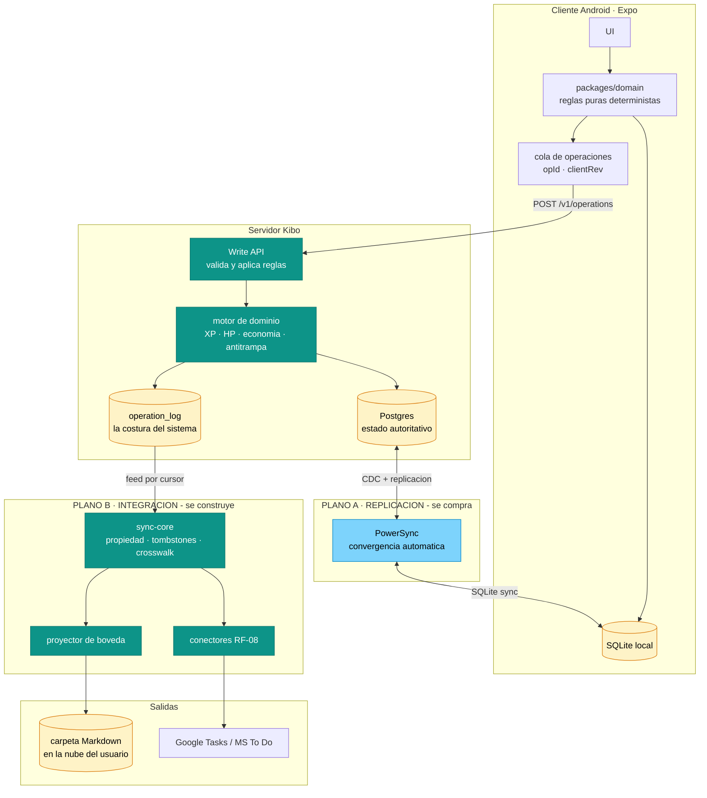
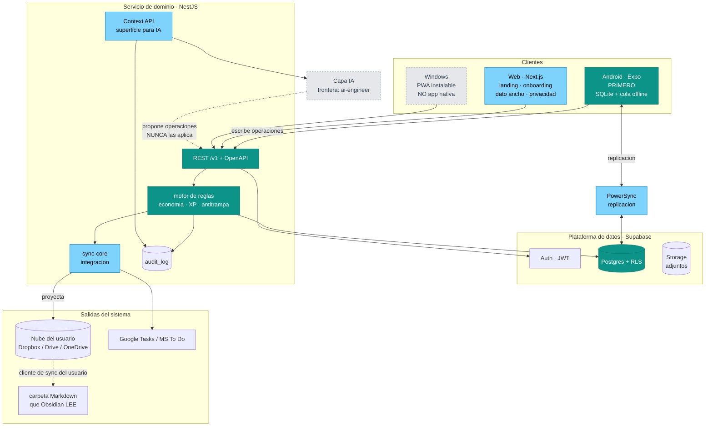

# 01 · Arquitectura de la plataforma Kibo

**Fecha:** 2026-08-08 · **Autor:** solution-architect · **Estado:** análisis de referencia (insumo de ADR-0002)
**Alcance:** arquitectura de plataforma — clientes, sincronización, topología, la bóveda como salida, y Kibo como almacén de contexto personal.
**Antecedentes:** `docs/analysis/obsidian/01-arquitectura-integracion.md` (R1) · `docs/analysis/obsidian/11-r2-arquitectura-conector.md` (R2) · `docs/adr/0001-obsidian-integration.md`
**Marco legal interno:** constitución del workspace **v1.7** — Art. 3 acotado a higiene de agentes, **Art. 12** gobierna el producto.

> **Leyenda de evidencia.** **[V]** hecho verificado, con fuente y fecha en §9 · **[I]** inferencia a partir de hechos verificados · **[S]** supuesto mío, refutable. Fuera de alcance por instrucción: UX y mercado.

---

## 0 · El reencuadre, y lo que hace con las rondas anteriores

Sergio movió tres piezas a la vez, y cada una invalida algo:

| Decisión de Sergio | Qué invalida |
|---|---|
| **Kibo es un Sistema Operativo Personal** — finanzas y salud son núcleo | La periferización de esos módulos. Y con la constitución v1.7, el Art. 3 ya no se puede citar como límite de producto |
| **Android primero**, web después, Windows "tal vez" | El "web desktop first, viewport mínimo 1280px" del contexto maestro v1.0 |
| **Kibo *emite* una bóveda; Obsidian la lee** | Obsidian como *socio*. Pasa a ser un **consumidor** de una salida del sistema |
| **La bóveda vive en una carpeta sincronizada a la nube** | El supuesto de R1/R2 de que la máquina del usuario es donde ocurre la integración |
| **IA para hablar con la propia información** | La IA como capa añadida. Pasa a ser el propósito que ordena el modelo de datos |

Y una que no cambia nada pero libera todo: **no hay nada construido.** El repo tiene 5 commits y ninguna entidad de dominio. No hay inversión de código que proteger, así que este documento puede recomendar sin negociar con el pasado.

**La tesis que ordena el resto:**

> **Kibo no es una app con IA. Es un almacén de contexto personal con superficies de acceso.** La app de Android es una superficie. La web es otra. La bóveda Markdown es una tercera. La IA es una cuarta. Ninguna es el sistema.

Si esa frase es cierta, entonces lo que hay que diseñar bien no son las pantallas: es **el modelo de datos uniforme, el log de operaciones y el control de acceso por categoría**. Todo lo demás son consumidores.

---

## 1 · Decisión P-1 — Estrategia de clientes

### 1.1 Criterios y pesos

Pesos elegidos para el contexto real: **un desarrollador solo, con background de React, sin código previo que proteger.**

| Criterio | Peso | Por qué |
|---|---|---|
| Velocidad de un dev solo con background React | **30%** | Es la restricción dominante. Un stack 20% mejor que tarda el doble no existe |
| Coste de mantener N clientes | **20%** | El fracaso más probable de este proyecto no es técnico: es no terminar |
| Offline real (SQLite local + ecosistema de sync) | **20%** | Consecuencia obligada de "Android primero" (§2) |
| Acceso al sistema de archivos en Android (SAF) | **15%** | La bóveda lo exige, aunque §4 lo degrada |
| Madurez y riesgo de plataforma | **15%** | Un dev solo no puede absorber roturas de ecosistema |

### 1.2 Evaluación

| Opción | React-fit | N clientes | Offline | SAF | Madurez | **Total** |
|---|---|---|---|---|---|---|
| **Nativo Kotlin/Compose** | 1 | 1 | 4 | **5** | 5 | **2.55** |
| **React Native (bare)** | 4 | 4 | 4 | 4 | 4 | **4.00** |
| **Expo** | **5** | **4** | **5** | **4** | **4** | **4.50** |
| **Flutter** | 2 | 4 | 4 | 4 | 5 | **3.55** |
| **PWA sola** | 5 | 5 | 2 | **1** | 3 | **3.50** |

Notas de puntuación, no adornos:
- **Kotlin nativo** gana en SAF y madurez y pierde todo lo demás: para un dev de React es una curva completa, y no da web ni Windows, así que implica **tres bases de código**. Se hunde en los dos criterios de mayor peso.
- **Flutter** rinde bien y es maduro, pero Dart es un lenguaje nuevo **y** no comparte nada con la web de Next.js. El impuesto se paga dos veces.
- **PWA sola** queda descartada por SAF: un navegador en Android no puede escribir la carpeta de una bóveda. Sigue siendo válida *como web*, que es otra cosa (§1.4).
- **Expo** sobre React Native bare: mismo modelo, más resuelto. `expo-file-system` expone el namespace `StorageAccessFramework` para URIs SAF, y desde SDK 54 (sept-2025) los soporta dentro de las clases `File`/`Directory` **[V §9.1]**. Los permisos de directorio requieren Android R o superior **[V §9.1]**.

### 1.3 Recomendación

**Expo (React Native) para Android; Next.js para web; monorepo pnpm + Turbo compartiendo paquetes de dominio.**

Lo que se comparte de verdad — y esto hay que decirlo sin marketing:

| Se comparte | No se comparte |
|---|---|
| `packages/domain` — entidades, reglas puras, cálculo de XP, validaciones | **Las pantallas.** Se escriben dos veces |
| `packages/sync-core` — operaciones, política de propiedad, tombstones | Los componentes de UI |
| `packages/markdown-vault-format` — serializador de bóveda | La navegación |
| `packages/api-client` — cliente generado desde OpenAPI | Los estilos |
| El lenguaje (TypeScript) y el modelo mental | |

> **El code-sharing entre React Native y web es de lógica, no de interfaz.** Es el coste oculto más grande de esta estrategia y el argumento más fuerte para **no** construir web y móvil a la vez.

### 1.4 La recomendación incómoda sobre la web

Si Android es primero, **la web no debe replicar la app**. La maqueta de Claude Design tiene ~40 pantallas de escritorio; portarlas a móvil y mantener ambas es exactamente el escenario en el que un desarrollador solo no termina.

Recomiendo acotar `apps/web` a lo que el móvil no hace bien o no hace:

| Sí en web | No en web (v1) |
|---|---|
| Landing, precios, registro | Uso diario (hábitos, tareas, diario) |
| Onboarding y vinculación de cuentas | Todo lo que se usa de pie o en la calle |
| Vistas de dato ancho: cronograma, tableros, finanzas, exportación | Duplicar el juego completo |
| Panel de privacidad y consentimientos (Art. 12) | |
| Conversación con la IA sobre el propio contexto | |

Es una decisión de arquitectura con efecto directo en el esfuerzo, y le corresponde a `product-planner` ratificarla.

---

## 2 · Decisión P-2 — El motor de sincronización

Ésta es la pregunta central de la ronda y mi respuesta se aparta de la premisa.

### 2.1 Los tres consumidores no son el mismo problema

| | **A · Móvil ↔ servidor** | **B · Servidor → bóveda** | **C · RF-08 proveedores** |
|---|---|---|---|
| Esquema en ambos lados | **Idéntico** | Distinto, con pérdida | Distinto, con pérdida |
| Identidad | El mismo id | Crosswalk | Crosswalk |
| Convergencia | Automática y **obligatoria** | Best-effort | Best-effort |
| ¿Puede intervenir el usuario? | **Nunca** — es la misma app | Sí | Sí |
| Latencia aceptable | Segundos | Minutos | Minutos u horas |
| Fallo aceptable | **Ninguno** | Excepción visible | Excepción visible |
| Volumen | Todo lo del usuario | Subconjunto proyectado | Subconjunto proyectado |

**A es replicación. B y C son integración.** No es una distinción académica:

> **Replicación** = los mismos datos en dos copias del mismo esquema, que deben converger solas y en silencio.
> **Integración** = datos distintos, esquemas distintos, mapeo con pérdida, y a veces hace falta preguntarle al usuario.

Un motor optimizado para replicación no sabe qué hacer con una nota de Obsidian que perdió su frontmatter. Un motor de integración con política de propiedad y excepciones visibles sería un desastre como replicación: nadie quiere un cuadro de diálogo porque el teléfono estuvo en el metro.

### 2.2 Veredicto: dos motores, un solo log

**No comparten algoritmo de convergencia. Sí comparten el modelo de datos y el log de operaciones.**

El argumento decisivo no es de pureza, es de riesgo:

> Escribir tu propio motor de **replicación** offline-first —relojes lógicos, convergencia, particiones de red, reconciliación— es de los problemas más difíciles que hay, y existen librerías maduras. Escribirlo tú, siendo un desarrollador solo, es la vía más rápida a la **corrupción silenciosa de datos**: el fallo que no ves hasta que un usuario pierde tres meses de diario.
>
> El motor de **integración**, en cambio, no existe como librería, porque es específico de tu dominio. Ése sí lo escribes tú — y ya lo diseñaste en R1 y R2.

**Regla derivada: compra la replicación, construye la integración.**

### 2.3 El punto de unión: el log de operaciones

Toda mutación del dominio se expresa como una `Operation`:

```ts
type Operation = {
  opId: string;        // ULID generado por el CLIENTE -> idempotencia
  userId: string;
  entity: EntityRef;   // { type: 'task' | 'habit' | 'consultation' | ..., id }
  kind: string;        // 'task.complete' | 'habit.tick' | 'note.upsert'
  payload: JsonValue;
  actor: 'user' | 'system' | 'ai-suggested-user-confirmed';
  clientRev: number;   // reloj lógico por dispositivo
  occurredAt: string;  // hora del cliente, informativa
  appliedAt?: string;  // hora del servidor, autoritativa
};
```

Ese log es la costura de todo el sistema:

- **A** lo transporta (el motor de replicación).
- **B** lo consume como *feed* para proyectar la bóveda: idempotente por `opId`, reanudable por cursor, auditable.
- **C** lo consume igual para Google Tasks / MS To Do.
- **La IA** lee el estado; el log le da la auditoría que exige el Art. 12.

No es event sourcing completo: el estado sigue viviendo en tablas normales. El log es el **borde** del sistema, no su almacén.

### 2.4 Elección del motor de replicación

| Opción | Qué da | Qué cuesta |
|---|---|---|
| **PowerSync** | Postgres→SQLite gestionado por CDC, SDK de React Native, plan gratuito, edición self-host source-available bajo licencia FSL, SDKs cliente Apache-2.0 **[V §9.2]** | Dependencia de proveedor; precio escala con instalaciones/DAU **[V §9.2]** |
| **ElectricSQL** | Postgres→SQLite local-first, open source **[V §9.3]** | Ecosistema más joven **[S]** |
| **WatermelonDB** | Base local reactiva, estándar práctico en React Native; protocolo pull/push que **tú** implementas **[V §9.3]** | Escribes el endpoint de sync: vuelve el riesgo de §2.2 |
| **RxDB** | Replicación a cualquier backend **[V §9.3]** | Más genérico, más pegamento |

**Recomendación: PowerSync**, con una salida documentada.

La salida importa tanto como la elección: **el estado autoritativo sigue siendo tu Postgres y el log de operaciones es tuyo**, así que cambiar de motor de replicación no es una migración de datos — es cambiar el transporte. Eso convierte una decisión de proveedor en una decisión reversible, que es la única forma de tomarla sin agonizar.

### 2.5 La consecuencia que nadie ve venir: economía optimista vs. autoritativa

Offline-first + reglas de juego chocan. Si el usuario completa una tarea en el metro, la app tiene que decir "+20 XP" al instante; pero el XP autoritativo lo calcula el servidor. Es el patrón de los videojuegos y hay que diseñarlo, no descubrirlo:

| Operación | ¿Optimista offline? | Por qué |
|---|---|---|
| Completar tarea / hábito | ✅ Sí | Determinista: el cliente aplica la misma fórmula pura de `packages/domain` |
| XP, nivel, racha | ✅ Sí, con reconciliación silenciosa | El servidor recalcula y corrige sin ceremonia |
| Perder HP por fallo | ✅ Sí | Determinista |
| **Abrir un cofre** | ❌ **No. Requiere red** | Hay **aleatoriedad**. Si el cliente la resuelve, se puede reintentar hasta ganar |
| **Comprar en la tienda** | ❌ No | Doble gasto del mismo saldo en dos dispositivos offline |
| **Retos compartidos, marcadores, regalos** | ❌ No | Involucran a otro usuario |
| Escribir notas, diario, tareas, consultas | ✅ Sí | Es contenido, no economía |

> **Regla: el cliente puede calcular lo que es determinista; el servidor decide todo lo que tiene azar, escasez o a otra persona involucrada.** Sin esta línea, la economía de Kibo se puede farmear poniendo el teléfono en modo avión.

### 2.6 Diagrama del motor unificado



**Lectura:** el plano azul se compra, el plano teal se construye, y el `operation_log` los une. Las escrituras suben por la Write API (nunca directo a Postgres desde el cliente); las lecturas bajan por replicación. Eso resuelve el anti-cheat y el offline con el mismo mecanismo.

---

## 3 · Decisión P-3 — Topología

### 3.1 ¿Siguen teniendo sentido `apps/web` + `apps/api` separados?

**Sí, y ahora más que antes** — pero con un cambio de rol que hay que declarar:

> Con un cliente móvil de primera clase, **`apps/web` deja de tener lógica de negocio**. Pasa a ser un cliente, igual que el móvil. Toda regla de dominio vive en un solo servicio.

Meter la API en las route handlers de Next.js sería el error clásico: acopla el contrato del que depende una app instalada al ciclo de vida y al modelo de despliegue de un framework de frontend.

### 3.2 ¿BaaS o backend propio?

La tensión es real y no tiene respuesta ideológica.

| | A favor de Supabase | En contra |
|---|---|---|
| Auth | Resuelto, y es lo más peligroso de hacer a mano | — |
| Postgres gestionado + migraciones + Storage | Resuelto | — |
| **RLS** (row level security) a nivel de base | Defensa en profundidad para el Art. 12: si la lógica falla, la base sigue negando **[V §9.4]** | — |
| Coste | Plan gratuito real; Pro desde $25/mes **[V §9.4]** | Escala por uso |
| **Reglas de dominio de Kibo** | — | **No caben en RLS.** Economía, XP compuesto, cofres con azar, rachas, anti-cheat, retos compartidos: eso es lógica, no políticas de fila |

**Recomendación: híbrido, con una frontera nítida.**

- **Supabase** = plataforma de datos: Postgres gestionado, **Auth**, RLS, Storage, migraciones.
- **Un solo servicio de dominio** (`apps/api`, NestJS) = **el único que escribe** las tablas de juego y de dominio.
- **PowerSync** = replicación de lectura hacia el móvil.
- Los clientes **leen** por replicación y **escriben** por la Write API. Nunca al revés.

Para un desarrollador solo esto es el mejor reparto disponible: se compra lo que es peligroso hacer mal (auth, replicación, gestión de Postgres) y se construye lo único que nadie puede darte hecho (tu dominio).

### 3.3 REST, tRPC o GraphQL

**REST + OpenAPI, versionado en la ruta (`/v1/`).**

El argumento decisivo es específico de tener una app instalada:

> Una app móvil vive **meses** en versiones viejas en el teléfono de la gente. tRPC no tiene versionado: su contrato es "el tipo que compilaste contra el servidor". En web da igual, porque siempre sirves la última. Con una app instalada, un usuario en la build de hace cuatro meses tiene que seguir funcionando. **[I, sobre §9.5]**

Además, tRPC solo sirve a clientes TypeScript; si algún día hay un cliente Kotlin o Swift, hay que construir otra capa **[V §9.5]**. GraphQL se descarta por sobrecoste: resuelve el problema de muchos clientes con necesidades de datos distintas, y aquí hay dos clientes propios con el mismo modelo — se pagaría N+1, caching y complejidad de esquema sin comprar nada.

Matiz que hace REST más que suficiente: **la mayoría de las lecturas no pasan por la API.** Pasan por la réplica local de SQLite. La API es sobre todo para **mutaciones** —que son operaciones del log— y para lo que no se replica. La superficie es pequeña.

Tipos generados desde el esquema OpenAPI hacia `packages/api-client`: se recupera casi toda la ergonomía de tRPC sin perder el versionado.

### 3.4 Autenticación

**Supabase Auth.** JWT compartido por web y móvil; el servicio de dominio valida la firma; RLS usa el mismo `sub` como red de segundo nivel. En móvil, el refresh token va en almacenamiento seguro del sistema (`expo-secure-store`), nunca en `AsyncStorage`. **No inventar autenticación** — es la decisión de menor retorno y mayor riesgo que puede tomar un desarrollador solo.

### 3.5 Topología recomendada



---

## 4 · Decisión P-4 — La bóveda como salida del sistema

### 4.1 Reevaluación de la matriz de transportes con la app nativa dentro

En R1 el plugin de Obsidian ganó por tres razones. Con el nuevo encuadre, **las tres se caen**:

| Ventaja del plugin en R1 | Estado en R3 | Por qué |
|---|---|---|
| Único transporte con **móvil** | ❌ Ya no aplica | Kibo tiene su propia app Android |
| Recibe **eventos de renombrado** nativos | ❌ Ya no importa | Los eventos de rename importan cuando la bóveda es **fuente de la verdad**. Ahora es **salida**: si el usuario renombra, Kibo regenera desde su base y el daño es cosmético |
| `fileManager.renameFile` reescribe **wikilinks** | ❌ Ya no aplica | Eso importa cuando Kibo renombra archivos **del usuario**. En una bóveda proyectada, los archivos y los enlaces son de Kibo |

**Conclusión: el plugin baja de transporte primario a complemento opcional.** Es un cambio real respecto a ADR-0001 y hay que registrarlo.

### 4.2 La matriz revisada

| # | Transporte | Cubre el escenario de Sergio | Fricción | Móvil | Riesgo | Veredicto R3 |
|---|---|---|---|---|---|---|
| **T6 · Conector de nube del usuario** (servidor → Dropbox/Drive/OneDrive) | **Sí, exactamente** | OAuth, sin instalar nada | n/a — servidor a servidor | Medio | ✅ **PRIMARIO** |
| **T7 · App Android escribe carpeta local vía SAF** | Parcialmente | Elegir carpeta una vez | ✅ | Medio-alto | 🟡 Secundario |
| **T8 · Descarga bajo demanda** (ZIP de la bóveda) | Sí, manualmente | Cero | ✅ | Nulo | ✅ Piso de día uno |
| **T4 · Plugin de Obsidian** | Sí, pero exige instalarlo | Media | ✅ | Medio | ⬇️ **Complemento opcional** |
| **T2 · `obsidian://` deep links** | Complementa | Cero | ✅ | Nulo | ✅ Se mantiene |
| **T1 · File System Access API** | No | — | ❌ | — | ❌ Sin cambio: solo import/export |
| **T3 · Local REST API** · **T5 · agente local** | No | — | — | — | ❌ Sin cambio: excluidos |

### 4.3 Por qué el conector de nube sube a primario

El escenario declarado por Sergio es: **bóveda en una carpeta de su Windows, sincronizada a la nube; Kibo en Android.**

Ninguna otra ruta lo resuelve sin que el teléfono y el PC estén encendidos a la vez:

- El **servidor** escribe a la nube por API → el cliente de sincronización del usuario lo baja a su Windows → Obsidian lo lee. **El teléfono no participa, y el PC tampoco tiene que estar encendido cuando Kibo escribe.**
- Cubre además cualquier otro lector: Logseq, Zettlr, VS Code, o solo el explorador de archivos. Que es exactamente lo que Sergio pidió: *"que el mismo Kibo nos genere una estructura que pueda interpretar Obsidian"*.

Límite conocido: **Obsidian Sync no expone API pública** **[V, R1 §12.15]**, así que quien use la sync oficial de Obsidian queda fuera de T6 y necesita T4 o T7. Es la razón por la que el plugin no se elimina, solo se degrada.

### 4.4 Un solo escritor, siempre

> **La bóveda tiene exactamente un escritor lógico: el proyector del servidor.**

Si el cliente móvil también escribiera archivos, volveríamos al problema de R1 —dos escritores del mismo archivo— por la puerta de atrás. El espejo local que T7 crea en Android es de **solo descarga**: el servidor genera, el móvil materializa. Un escritor lógico, aunque haya dos manos.

### 4.5 El riesgo verificado que hay que subrayar: OneDrive Files On-Demand

**[V §9.6]** OneDrive puede eliminar archivos localmente para liberar espacio (*Files On-Demand*). Los archivos siguen existiendo en la nube pero **no en el disco**. La documentación de Obsidian advierte que su propio Sync interpreta eso como borrados y elimina las notas de la bóveda remota.

Consecuencia directa para Kibo: **cualquier lector del sistema de archivos verá archivos fantasma.** Y aquí ocurre algo que vale la pena señalar:

> La mitigación ya está tomada. **KS-04 y D-9 de la ronda 2 —no propagar borrados nunca— resultan ser también la defensa contra un fallo real de plataforma**, no solo contra el error humano. Una decisión de seguridad se convirtió en una decisión de robustez.

Añado un control derivado: si el proyector detecta que **desaparecieron archivos que él mismo escribió**, no reacciona — los reescribe en el siguiente ciclo. Nunca interpreta ausencia como intención.

---

## 5 · Decisión P-5 — Kibo como almacén de contexto personal

Ésta es la parte que Sergio puso en el centro, y la que más impone al modelo de datos.

### 5.1 Modelo de datos uniforme — el sobre de contexto

Si cada módulo (finanzas, salud, diario, hábitos, lectura) inventa su forma, la IA necesita N integraciones y el sistema no es un almacén de contexto: es diez apps en un mismo login. La condición mínima es que **toda entidad de dominio se pueda ver bajo una forma común**:

```ts
type ContextItem = {
  id: string;                  // ULID
  userId: string;
  type: string;                // 'health/consultation' | 'task' | 'journal/entry' ...
  category: DataCategory;      // health | financial | journal | productivity | resources | social
  sensitivity: 'special' | 'personal' | 'low';   // dispara el Art. 12
  occurredAt: string;          // cuando paso en el mundo
  recordedAt: string;          // cuando entro a Kibo
  title: string;
  body?: string;               // texto libre, si lo hay
  attributes: JsonValue;       // campos tipados del type
  links: EntityRef[];          // relaciones -> son los wikilinks de la boveda
  provenance: 'user' | 'import' | 'derived' | 'ai-suggested';
};
```

Tres propiedades no negociables de este sobre:

1. **`category` y `sensitivity` son de primera clase**, no una etiqueta añadida después. Son lo que hace aplicable el Art. 12 en tiempo de ejecución en vez de en un documento.
2. **`links` es el mismo grafo que la bóveda emite como wikilinks** (R2 §4.1: los hechos son notas-registro, las dimensiones son notas de referencia, los wikilinks hacen el join). Un solo grafo, dos representaciones.
3. **`provenance` distingue lo que dijo el usuario de lo que dedujo la IA.** Sin eso, en seis meses nadie sabe qué parte del "contexto personal" es real y qué parte la alucinó un modelo. Es la contaminación más difícil de revertir de todo el sistema.

### 5.2 La superficie de consulta

Yo defino el contrato; `ai-engineer` define quién lo consume y cómo.

```ts
queryContext(userId, {
  categories: DataCategory[],       // filtrado ANTES de recuperar, no despues
  timeRange?: { from: string; to: string },
  types?: string[],
  entities?: EntityRef[],           // "todo lo relacionado con [[Naproxeno]]"
  text?: string,
  limit: number,
  purpose: string,                  // se registra en auditoria
}) => { items: ContextItem[], redacted: RedactionReport }
```

Dos reglas de diseño en la firma misma:

- **El filtro por categoría se aplica antes de recuperar, no al formatear.** Un dato que el usuario no autorizó **nunca entra al proceso**. Filtrar al final es como no filtrar.
- **`redacted` es explícito.** La respuesta declara qué se dejó fuera y por qué, para que la IA pueda decir "no puedo ver tus finanzas porque no me diste permiso" en vez de inventar.

### 5.3 Matriz de residencia de datos (Art. 12 — obligatoria antes de código)

El Art. 12 exige declarar, por categoría, dónde **puede** vivir el dato y dónde **nunca**. Ésta es mi propuesta; requiere ratificación de Sergio y revisión de `security-auditor`.

| Categoría | Dispositivo | Servidores Kibo | **Bóveda del usuario** | **LLM de terceros** |
|---|---|---|---|---|
| **Salud** (`special`) | ✅ | ✅ | 🟡 **Opt-in por módulo** | ⛔ **Solo con DPA firmado** (retención cero/mínima + no-entrenamiento + subprocesadores) |
| **Finanzas — importes** (`special`) | ✅ | ✅ | ⛔ **Nunca** | ⛔ **Solo con DPA** |
| **Finanzas — estructura** (cuentas, categorías, sin cifras) | ✅ | ✅ | 🟡 Opt-in | 🟡 Con consentimiento |
| **Diario** (`special` — revela creencias y estado mental) | ✅ | ✅ | ✅ | 🟡 Consentimiento separado |
| **Productividad** (tareas, hábitos, proyectos) | ✅ | ✅ | ✅ | ✅ Con consentimiento |
| **Recursos** (notas) | ✅ | ✅ | ✅ | ✅ Con consentimiento |
| **Social** (amigos, retos) | ✅ | ✅ | ⛔ Datos de terceros | ⛔ |
| **Credenciales / tokens** | Almacén seguro del SO | Cifrado, nunca en logs | ⛔ | ⛔ |

Tres notas sobre esta matriz:

- **"Finanzas — importes: nunca a la bóveda"** ya estaba en R2 y **sobrevive a la enmienda constitucional**. Ya no lo justifica el Art. 3 (que quedó acotado a agentes): lo justifica que la bóveda sale del control de Kibo hacia el Dropbox/iCloud/git del usuario, y una cifra en un `.md` no tiene forma de ser retirada. Es un argumento de residencia, no de estatuto.
- **El diario se clasifica `special`** aunque no aparezca en la lista literal del Art. 12: revela creencias, salud mental y vida privada. Clasificarlo por debajo sería cumplir la letra y fallar el propósito.
- **La categoría "social" nunca sale**, porque contiene datos de personas que no consintieron nada.

### 5.4 Auditoría

Cada acceso al contexto se registra: `who`, `when`, `categories`, `itemIds`, `purpose`, `model`, `retentionPolicy`, `consentVersion`. Es requisito directo del Art. 12 (consentimiento revocable, DPIA, cascada de borrado a procesadores) y, además, es lo que permite responder la pregunta que un usuario hará tarde o temprano: *"¿qué sabe de mí la IA y quién se lo dio?"*

**La IA no tiene autoridad** (KS-07, R2). Propone operaciones; el motor de dominio las aplica tras confirmación del usuario, y quedan marcadas `actor: 'ai-suggested-user-confirmed'`. Nunca otorga XP, nunca escribe la bóveda, nunca muta dominio por su cuenta.

### 5.5 Modelo comercial de la IA — Sergio pidió recomendación explícita

| Modelo | A favor | En contra |
|---|---|---|
| **BYOK** (el usuario trae su llave) | Coste marginal cero para Kibo; el usuario contrata directo al proveedor, lo que **reduce mucho** la exposición contractual | No la elimina: si Kibo transmite el dato, Kibo sigue siendo responsable del tratamiento. Fricción alta: pocos usuarios tienen API key |
| **Incluido en Premium con cuota** | Simple de entender y de vender | Coste variable contra precio fijo: el 5% de usuarios más intensos se come el margen |
| **Créditos comprados con gemas** | Encaja con la economía existente | 🚩 **Fallo de diseño económico** |

> **La bandera roja:** las gemas se **ganan jugando** (cofres, retos). Si las gemas pagan tokens, el usuario puede farmear hábitos para pagar tu factura de inferencia. Es convertir un coste de infraestructura en una recompensa del juego.

**Recomendación: híbrido, con una distinción tajante.**

1. **BYOK desde el día uno.** Sin margen, sin coste, sin DPA propio, y disponible para el usuario avanzado — que es quien lo va a pedir primero.
2. **Cuota mensual incluida en Premium**, con llave de Kibo, dimensionada para el uso normal.
3. **Las gemas compran acceso a la *función*, nunca *tokens*.** Desbloquear "Inteligencia" en la Tienda cuesta gemas una vez; el consumo recurrente lo paga la suscripción o la llave del usuario. Esa línea es lo que separa una economía de juego sana de un subsidio involuntario.

**Condicionante duro del Art. 12:** ningún dato de categoría especial llega a un LLM de terceros sin DPA firmado con retención cero o mínima, cláusula de no-entrenamiento y lista de subprocesadores — **y el artículo dice explícitamente que sin ese contrato la función no se lanza, aunque el usuario consienta.** Tres salidas posibles para v1, en orden de rapidez: (i) la IA solo ve categorías no especiales; (ii) BYOK con consentimiento explícito y advertencia; (iii) se firma el DPA. Es decisión de Sergio con `security-auditor`, no mía.

---

## 6 · Decisión P-6 — ¿Windows sí o no?

Sergio dijo *"tal vez, si aporta valor y es prudente"*. La respuesta con criterio:

**No como app instalable, ni ahora ni previsiblemente. Sí como PWA instalable desde la web.**

Tres razones, en orden de peso:

1. **La web ya cubre Windows.** Una app de escritorio que envuelve la misma web añade instalador, firma de código —**no negociable en 2026: Windows Defender y Gatekeeper marcan lo no firmado** **[V §9.7]**—, canal de auto-actualización y superficie de soporte, sin añadir **ninguna capacidad**.
2. **La única capacidad que añadiría ya está cubierta.** Sería escribir la bóveda en la carpeta local. Pero el conector de nube (T6) hace justo eso: el servidor escribe a OneDrive/Drive y el cliente de sincronización del usuario la materializa en su disco. La razón que justificaría Windows la resuelve una decisión que ya tomamos.
3. **Una PWA instalable da el 80% de lo que la gente llama "app de Windows"** —icono, ventana propia, arranque directo, caché offline— con coste de mantenimiento **cero adicional**, porque es la misma web.

**Criterio explícito para reabrir la decisión** (para que no se reabra por entusiasmo):
- Se necesita una capacidad de sistema operativo que la web no da: atajos globales, watcher real del sistema de archivos, integración con la bandeja, arranque con el sistema; **o**
- se mide demanda real de bóveda local sin nube.

Si algún día se cumple: **Tauri**, no Electron. Un Tauri v2 mínimo pesa menos de 600 KB y una app típica 3–15 MB, frente a instaladores de Electron de 50–150 MB, porque usa el WebView del sistema **[V §9.7]**. Tauri trae actualizaciones diferenciales y verificación de firma integradas **[V §9.7]**. El coste es Rust en el toolchain de un desarrollador de React — asumible **solo** si la decisión ya se justificó por otra vía.

---

## 7 · Impacto en las rondas anteriores

| Decisión previa | Estado |
|---|---|
| **Plugin de Obsidian como transporte primario** (ADR-0001) | ⬇️ **Degradado a complemento opcional** (§4.1) |
| **Conector de nube como "transporte 2, ADR futuro"** | ⬆️ **Sube a primario** (§4.3) |
| **Decisión abierta #1: "¿Recursos deja de ser editor?"** | ✅ **Se resuelve sola.** Si la bóveda es salida del sistema, no es un editor autoritativo: nunca hubo dos editores. Recursos se edita en Kibo y la bóveda es su proyección |
| **Procedencia (`kibo` / `adopted` / `read` / `foreign`)** | ✅ Vigente, pero se **reordena**: el caso central pasa a ser `kibo`; `adopted` y `read` quedan para el flujo de **importar una bóveda preexistente**, que deja de ser el escenario principal |
| **Regiones** (frontmatter declarado, bloque generado, zona del usuario) | ✅ Vigente sin cambios |
| **KS-01 root único** | ✅ **Se simplifica.** Al dejar de ser central la adopción, la ampliación que R2 escaló a `security-auditor` deja de ser urgente |
| **"Finanzas nunca a la bóveda"** | ✅ Sobrevive, con **argumento nuevo**: residencia, no estatuto (§5.3) |
| **"Salud opt-in por módulo"** | ✅ Ratificado por la vía formal (constitución v1.7, Art. 3 + Art. 12) |
| **Contrato de frontmatter** | ✅ Vigente y **más importante**: es la representación externa del sobre de contexto (§5.1) |
| **No propagar borrados (KS-04/D-9)** | ✅ Vigente y **reforzado** por un motivo nuevo: OneDrive Files On-Demand (§4.5) |

---

## 8 · Riesgos y supuestos abiertos

| # | Riesgo / supuesto | Tipo | Mitigación |
|---|---|---|---|
| R1 | Web y móvil comparten lógica pero **no pantallas** | **[I]** | Acotar la web (§1.4). Es la decisión de esfuerzo más grande del documento |
| R2 | Dependencia de PowerSync | **[V §9.2]** | El estado autoritativo y el log son propios: cambiar de motor es cambiar transporte, no migrar datos |
| R3 | SAF en Android sobre carpetas de proveedores de nube | **[S]** | Drive y OneDrive se exponen como `DocumentsProvider`, no como archivos reales; escribir ahí vía SAF es frágil. Por eso T7 es secundario |
| R4 | Los permisos SAF se auto-revocan si la app no se usa en meses; tope de 512 grants persistidos | **[V §9.1]** | Re-solicitar con gracia; verificar el permiso en cada uso |
| R5 | OneDrive Files On-Demand hace desaparecer archivos localmente | **[V §9.6]** | No propagar borrados nunca; reescribir lo propio (§4.5) |
| R6 | Coste variable de la IA contra precio fijo | **[I]** | Cuota + BYOK; nunca tokens por moneda ganable (§5.5) |
| R7 | **Sin DPA, la función de IA sobre datos especiales no puede lanzarse** aunque el usuario consienta | **[V]** constitución v1.7 Art. 12 | Decidir la salida (i)/(ii)/(iii) **antes** de construir la capa de IA |
| R8 | Un desarrollador solo con tres clientes | **[I]** | Windows fuera (§6); web acotada (§1.4); comprar auth y replicación (§3.2) |
| R9 | Expo SDK y su cadencia de versiones | **[V §9.1]** parcial | El dato verificado es SDK 54 (sept-2025); **no verifiqué la versión vigente a ago-2026**. Confirmar antes de fijar el `package.json` |

---

## 9 · Fuentes

Todas consultadas el **2026-08-08**.

| # | Fuente | Qué respalda |
|---|---|---|
| 9.1 | [Expo — File System gets a major upgrade in SDK 54](https://expo.dev/blog/expo-file-system) · [expo-file-system docs](https://github.com/expo/expo/blob/master/docs/pages/versions/unversioned/sdk/filesystem.md) · [Android — Storage Access Framework](https://developer.android.com/guide/topics/providers/document-provider) | Namespace `StorageAccessFramework` y URIs SAF; soporte en `File`/`Directory` desde SDK 54 (sept-2025); permisos de directorio solo en Android R+; grants persistidos (512 en API 30+, 128 antes); auto-reset de permisos por inactividad |
| 9.2 | [PowerSync — pricing](https://powersync.com/pricing) · [PowerSync — open source](https://powersync.com/open-source) · [PowerSync · Supabase partners](https://supabase.com/partners/powersync) | Postgres/MongoDB → SQLite por CDC; SDK de React Native; plan gratuito; Open Edition source-available bajo FSL; SDKs cliente Apache-2.0 |
| 9.3 | [Best offline-first tech stack 2026](https://cssauthor.com/offline-first-tech-stack/) · [RxDB — React Native database](https://rxdb.info/react-native-database.html) · [WatermelonDB + Expo SDK 54](https://dev.to/fasthedeveloper/watermelondb-expo-sdk-54-the-complete-mobile-offline-first-setup-guide-that-actually-works-5he5) | Panorama de motores offline-first; WatermelonDB como estándar práctico en React Native; ElectricSQL Postgres→SQLite |
| 9.4 | [Supabase pricing 2026](https://www.metacto.com/blogs/the-true-cost-of-supabase-a-comprehensive-guide-to-pricing-integration-and-maintenance) · [Supabase review 2026](https://hackceleration.com/labs/review/supabase) | Plan gratuito; Pro desde $25/mes + uso; RLS en la capa de base como control de acceso |
| 9.5 | [tRPC vs GraphQL vs REST 2026](https://apiscout.dev/guides/trpc-vs-graphql-vs-rest-2026) · [REST vs tRPC vs GraphQL vs gRPC 2026](https://apiscout.dev/guides/death-of-rest-type-safe-api-patterns-2026) | tRPC exige clientes TypeScript y no extiende a clientes Swift/Kotlin; patrón híbrido tRPC interno + REST para clientes móviles; GraphQL para clientes con necesidades de datos distintas |
| 9.6 | [Obsidian Help — Sync your notes across devices](https://retypeapp.github.io/obsidian/sync-notes/) · [Obsidian Forum — Android SAF feature request](https://forum.obsidian.md/t/android-support-the-storage-access-framework-store-vault-in-google-drive-etc/23234) | OneDrive Files On-Demand elimina archivos localmente y Obsidian Sync lo interpreta como borrado; SAF en Obsidian Android como petición abierta |
| 9.7 | [Tauri vs Electron 2026 — bundle, RAM, security](https://www.pkgpulse.com/guides/electron-vs-tauri-2026) · [Desktop apps from web 2026](https://www.digitalapplied.com/blog/desktop-apps-web-stack-tauri-electron-deno-wails-2026) | Tauri v2 <600 KB de núcleo, 3–15 MB típico, vs 50–150 MB de Electron; firma de código no negociable en 2026; Tauri con actualizaciones diferenciales y verificación de firma |
| 9.8 | [Kotlin Multiplatform vs React Native](https://kotlinlang.org/docs/multiplatform/kotlin-multiplatform-react-native.html) · [React Native vs Flutter vs Expo 2026](https://www.devtoolreviews.com/reviews/react-native-vs-flutter-vs-expo-2026) | Comparativa de frameworks; Expo como ruta más rápida para un equipo con background JavaScript/React |
| — | `constitution.md` v1.7 (workspace) | Art. 3 acotado a agentes; Art. 12 (matriz de residencia en ADR, DPA obligatorio, consentimiento granular, export/erasure, DPIA, GDPR + LFPDPPP) |

---

## 10 · Recomendación

### 10.1 Veredicto

**Construir Kibo como un almacén de contexto personal con superficies de acceso: una app Expo para Android como cliente principal, un servicio de dominio único como autoridad, replicación comprada y no construida, y la bóveda Markdown como una salida del sistema entre varias.**

Ocho afirmaciones:

1. **Clientes:** Expo para Android, Next.js para web **acotada** a lo que el móvil no hace bien, monorepo compartiendo dominio y no pantallas.
2. **Sincronización: dos motores, un solo log.** Replicación (móvil↔servidor) se **compra**; integración (bóveda, RF-08) se **construye**. Los une el `operation_log` con `opId` de cliente.
3. **Motor de replicación: PowerSync**, con salida documentada — el estado autoritativo y el log son propios, así que cambiarlo es cambiar transporte, no migrar datos.
4. **Economía partida en dos**: lo determinista se calcula optimista en el cliente; lo que tiene azar, escasez o a otra persona **exige red**. Sin esa línea, la economía se farmea en modo avión.
5. **Topología:** Supabase como plataforma de datos y **Auth**; un servicio de dominio NestJS como **único escritor**; **REST + OpenAPI versionado**, no tRPC, porque las apps instaladas viven meses en versiones viejas.
6. **La bóveda es salida, con un solo escritor lógico: el servidor.** El **conector de nube sube a transporte primario**; el plugin de Obsidian **baja a complemento**.
7. **Contexto:** sobre uniforme con `category`, `sensitivity` y `provenance` de primera clase; filtrado por categoría **antes** de recuperar; matriz de residencia del Art. 12 en el ADR; auditoría de cada acceso; la IA propone y nunca aplica.
8. **Windows: no** como app instalable; **sí** como PWA instalable. Si algún día se justifica, Tauri.

### 10.2 Lo que más me preocupa

**1 · El alcance creció y el equipo no.** Este documento describe una plataforma —app móvil offline-first, web, servicio de dominio, proyector de bóveda, conectores, capa de contexto para IA— construida por **una persona que está aprendiendo**, sobre un repo con cinco commits y ninguna entidad de dominio. Cada decisión aquí es defendible por separado; juntas son varios años-persona. **La arquitectura no es el riesgo del proyecto: el alcance lo es.** Mis tres palancas, en orden de ahorro: acotar la web a lo que el móvil no hace (§1.4), no construir Windows (§6), y comprar auth y replicación en vez de escribirlas (§2.2, §3.2). Recomiendo que `product-planner` trate ese recorte como decisión de producto, no como detalle de ejecución.

**2 · El Art. 12 puede bloquear el propósito declarado del producto, y conviene descubrirlo ahora.** Sergio quiere hablar con toda su información, incluidas salud y finanzas. El Art. 12 dice que **sin DPA firmado con retención cero/mínima y cláusula de no-entrenamiento, esa función no se lanza — aunque el usuario consienta**. O sea: la enmienda constitucional desbloqueó *almacenar* esos datos, pero no desbloqueó *enviarlos a un tercero*. Si la respuesta acaba siendo "la IA solo ve categorías no especiales", la promesa se recorta justo donde más valor prometía, y eso hay que saberlo **antes** de diseñar la experiencia, no después. Es una conversación de Sergio con `security-auditor`, y va primero en la fila.

**3 · Estamos diseñando el almacén de contexto antes de tener el contexto.** El sobre uniforme de §5.1 es la pieza más determinante del sistema —de él dependen la IA, la bóveda, la auditoría y el control por categoría— y hoy no existe **ni una** entidad de dominio contra la cual validarlo. El riesgo es diseñar la abstracción perfecta para los ejemplos con los que la razonamos. La mitigación es de secuencia, igual que en R2: **fijar ahora lo estructural e irreversible** —`category`, `sensitivity`, `provenance`, el log de operaciones, quién escribe qué— y **dejar sin congelar** el vocabulario de tipos y atributos hasta que existan tres módulos reales construidos. Un sobre con cinco campos correctos vale más que uno con veinte inventados.
